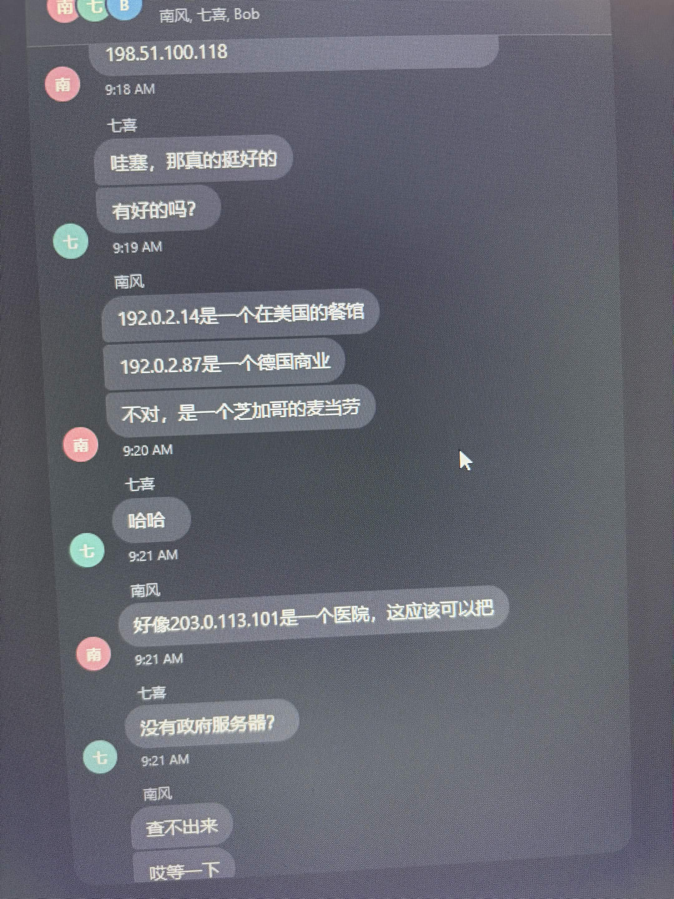

# Troubled Translation - OSINT (479 điểm)

**Flag:** `cdctf{McDonald's_in_Chicago}` · **Files:** `files/translation.zip`, 19609739 byte, sha256 `b4e5df962599ce981bc05a8d1fd9e3d007f9f74a55b305f58537540eff51e10b`

## Đề bài

Bob Burke (`bubu77`) bị thêm nhầm vào nhóm chat Chatterly và chụp lại hội thoại tiếng Trung. Cần dịch nội dung để xác định doanh nghiệp và thành phố của mục tiêu tiếp theo. Định dạng đề yêu cầu là `cdctf{Business_in_City}`; đề nguyên văn ở `de.md`.

## Phân tích

ZIP chứa năm ảnh JPEG chụp màn hình. Đọc theo thời gian: ảnh 5 → 4 → 3 → 2 → 1; các ảnh có đoạn trùng nhau. Đọc và dịch trực tiếp nội dung hội thoại trong ảnh.

## Lời giải

**Bước 1 - Đọc đoạn xác định thành phố.** Ảnh 4, lúc 9:20, có lời sửa lại địa điểm:

| Nguyên văn | Bản dịch |
| --- | --- |
| 192.0.2.14是一个在美国的餐馆 | 192.0.2.14 là một nhà hàng ở Mỹ. |
| 192.0.2.87是一个德国商业 | 192.0.2.87 là một doanh nghiệp ở Đức. |
| 不对，是一个芝加哥的麦当劳 | Không đúng, đó là một McDonald’s ở Chicago. |



**Bước 2 - Đối chiếu lựa chọn mục tiêu.** Ảnh 2, lúc 9:33, Nanfeng nói vẫn nghĩ mục tiêu trước đó là tốt nhất. Lúc 9:35, Qixi hỏi “那个？麦当劳？” — “Cái nào? McDonald’s à?”. Chi tiết này hỗ trợ suy luận mục tiêu là McDonald’s ở Chicago; chuỗi cờ cuối cùng được lưu trong flag.txt.


**Bước 3 - Kiểm tra bối cảnh.** Ảnh 1 nhắc `bubu778`, rồi nói “把八给忘记掉了” — “Quên mất số 8 rồi”. Điều này giải thích việc mời nhầm Bob (`bubu77`). Nó không quyết định cách viết flag.

## Kết quả

Chuỗi bỏ dấu nháy đã bị từ chối:

```text
cdctf{McDonalds_in_Chicago}
```

Flag đúng, giữ dấu nháy ASCII của tên thương hiệu:

```text
cdctf{McDonald's_in_Chicago}
```

Chuỗi trên được lưu trong `flag.txt`. Bản ghi chỉ xác định ngày 04/10/2026, không có giờ solve chính xác.

## Tái hiện

```powershell
python exploit.py files/translation.zip
```

Script liệt kê và giải nén ảnh vào `analysis/extracted/`. Đọc ảnh theo thứ tự đã nêu và đối chiếu các câu trong bảng; script không tự dịch hay in flag phỏng đoán.
