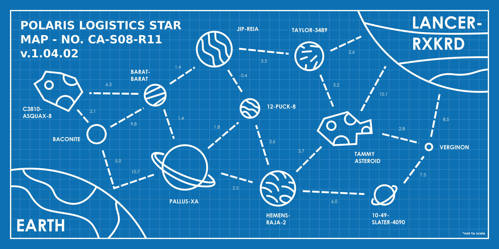

# Đề bài - a-star-trail

## Nguyên văn đề

```text
(You may have seen this last year)

Polaris Logistics has an urgent delivery that needs to be transported across the
star system. As the pilot of this V.I.P. (Very Important Package), you need to
begin planning your trip from Earth to Lancer-RXKRD immediately. Remember to
follow company protocol; you have to follow the designated paths between
planet/oids to comply with interplanetary law. If you can't deliver the V.I.P.
in under 25 days, you might as well forget about your end of year bonus.

- Polaris Logistics.

Submit your flag using the by combining the first character of each planet/oid in
your path together and then adding the number of days your path takes (with 1
decimal place) onto the end, separated by a dash. E.g. if your path from A-PLANET
TO B-PLANET was PAPA, OSCAR, SIERRA, TANGO, 2025PLANET and took exactly 5 days,
the flag would be CSSCTF{POST2-5.0}
```

## Thông tin đã xác minh từ file

| Mục | Giá trị |
| --- | --- |
| Artifact | `files/A_Star_Trail.png` (copy từ: `/c/Users/Administrator/Downloads/A_Star_Trail.png`) |
| Kích thước | 597693 byte |
| SHA-256 | `a3584ca68a0c808d727b07dd78600db2ad975ba4fecff75b16a82f82bc3d33ed` |
| Loại file | PNG image data, 3780 x 1890, 8-bit/color RGBA, non-interlaced |
| Nội dung | Bản đồ "POLARIS LOGISTICS STAR MAP - NO. CA-S08-R11 v.1.04.02", 13 thiên thể, 20 đường nét đứt có ghi số ngày |
| Nhiệm vụ | Đường đi ngắn nhất EARTH -> LANCER-RXKRD, dưới 25 ngày |
| Định dạng cờ | `CSSCTF{<chữ cái đầu mỗi chặng trung gian>-<số ngày 1 chữ thập phân>}` (đã kiểm: không tính EARTH và LANCER-RXKRD) |
| Điểm / độ khó | thẻ đề không được lưu lại trong phiên; `Beginner` là ước lượng theo bài tiếp theo (A Star Trail 2: 187 / Intermediate) |
| Trạng thái nộp | bản `EP1JTL-21.0` (tính cả hai đầu) nộp và bị từ chối; bản `CSSCTF{P1JT-21.0}` được chấp nhận |

Ảnh artifact (không phải ảnh thẻ đề):



## Hướng giải (tóm tắt)

Đồ thị nhỏ (13 nút, 20 cạnh) nên chỉ cần đọc trọng số trên ảnh rồi chạy Dijkstra.
Cờ ghép từ chữ cái đầu của từng thiên thể trên đường đi, nối với tổng số ngày.

## Chạy lại lời giải

```bash
python exploit.py
```

Kết quả: `CSSCTF{P1JT-21.0}` (đã lưu trong `flag.txt`).
