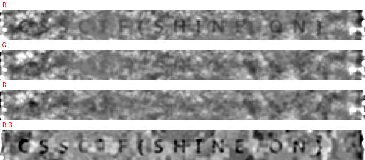

# Colour Shift — Forensics (Beginner)

**Flag:** `CSSCTF{SHINE ON}` · **Files:** `colorshiftctf.bmp`, 1083738 B, sha256 `689f33baf1acdef5c58b61a493977a44384694ef87f07a1f0606f1f34035ef92`

## Đề bài

"Một bức BMP và một câu đố về Isaac Newton." Đề cho đúng một file `colorshiftctf.bmp`, mô tả gợi việc tách ánh sáng thành các thành phần màu. Cờ theo dạng `CSSCTF{...}`, 124 điểm, hạng Beginner.

## Phân tích ban đầu

File là BMP hợp lệ đến từng byte: 599x602, 24 bpp, `BI_RGB`, `bfOffBits=138`, `biSizeImage=1083600`, và `138 + 1083600` khớp chính xác độ dài file nên không có dữ liệu nối thêm. Header là BITMAPV5HEADER 124 byte với mask `ff/ff00/ff0000` chuẩn, `biClrUsed=0`: ảnh truecolor, không có bảng màu để lợi dụng.

Ảnh mở lên là bìa The Dark Side of the Moon, nền rất tối (mean ba kênh R/G/B = 15.4 / 32.1 / 38.1) và phủ một lớp nhiễu hạt. Điểm bất thường duy nhất đo được: kênh R trải hết dải 0-255 trong khi G chỉ tới 240 và B tới 215, tức kênh đỏ "động" nhiều hơn hai kênh kia.

## Các hướng đã loại

1. **Dữ liệu nối thêm / chunk ẩn**: phần dư sau khối pixel bằng 0, `strings` không ra chuỗi nào đáng chú ý. Loại.
2. **Bảng màu hoặc header phụ**: 24 bpp `BI_RGB`, `biClrUsed=0`, phần mở rộng chỉ là gamma và color space. Loại.
3. **Stego LSB**: đóng gói bit thấp của cả ba kênh theo hai chiều đọc ảnh, cả kiểu MSB-first lẫn LSB-first và cả bản 3 bit mỗi pixel, rồi tìm `CSSCTF`: 0 kết quả. Loại.

Ba hướng trên đều là phản xạ với file ảnh; chúng sạch, và chính sự sạch đó đẩy về hướng duy nhất còn lại: chữ được vẽ đè lên ảnh với biên độ nhỏ hơn nhiễu nền.

## Chuỗi khai thác

**Bước 1 - Tách thành phần màu, đúng như đề gợi.** Không khuếch đại toàn ảnh (ảnh tối, kéo contrast là kéo cả nhiễu). Việc cần làm là bỏ đi nền tần số thấp của chính ảnh để phần chữ tần số trung bình còn lại.

```python
def residual(chan):
    bg = np.asarray(Image.fromarray(chan).filter(ImageFilter.MedianFilter(41)))
    return chan.astype(np.float32) - bg.astype(np.float32)
```

Median 41 px lớn hơn bề dày nét chữ nên nền bị ước lượng đúng, và khác với trừ Gaussian, nó không tạo vòng sáng/tối quanh nét.

**Bước 2 - So bốn kênh trên cùng một dải dòng.** Sau khi chuẩn hoá theo MAD và phóng to, kênh R và hiệu `R - B` hiện một dòng chữ; kênh G và kênh B thì phẳng. Lớp đè chỉ động vào đỏ, và `R - B` cho tương phản cao nhất vì hai kênh này chia sẻ đúng phần nhiễu nền nên trừ nhau là sạch nền.



**Bước 3 - Đọc dòng chữ.** Dải chứa chữ nằm ở dòng 404-436, chạy gần hết bề ngang ảnh.

```
C S S C T F { S H I N E   O N }
```

Ký tự phân cách giữa `E` và `O` là một dấu cách thật: khoảng cách đo được ~47 px so với nhịp chữ ~33 px, và không pixel nào trong khe đó vượt ngưỡng chữ trên cả bốn kênh. Bản band-pass trừ Gaussian trước đó có vẽ một vệt chéo trông như dấu `/` ngay khe này, nhưng đó là dao động nhân tạo của bộ lọc; đổi sang median thì vệt biến mất.

**Bước 4 - Kiểm chứng.** Quét cả ảnh xem còn dòng nào khác không: chỉ dải 404-436 có mật độ nét chữ, các dải đậm khác là cạnh tam giác và dải cầu vồng của bìa. Prefix `CSSCTF{` khớp định dạng đề yêu cầu, và toàn bộ phần trong ngoặc đọc được trong một dòng liên tục, không có ký tự nào phải suy đoán.

## Flag

```bash
python exploit.py files/colorshiftctf.bmp -o analysis
```

```
file      : files/colorshiftctf.bmp  599x602
  residual R  : min  -78.0 max +245.0  p99.9 +208.0
  residual G  : min  -86.0 max +214.0  p99.9 +172.0
  residual B  : min  -65.0 max +182.0  p99.9 +142.0

kenh do = R - B (tru nen median 41, hop thu 2x2)
vuong goc hoa: med 0.080  MAD-sd 1.186  z[min] -7.4
da ghi analysis\flag_line.png

so pixel net chu: 2774 (>=1500 de coi like co dong chu)
```

`analysis/flag_line.png` là dòng chữ đã khôi phục, đọc ra `CSSCTF{SHINE ON}`.

## Reproduce

```bash
python exploit.py files/colorshiftctf.bmp -o analysis
```
