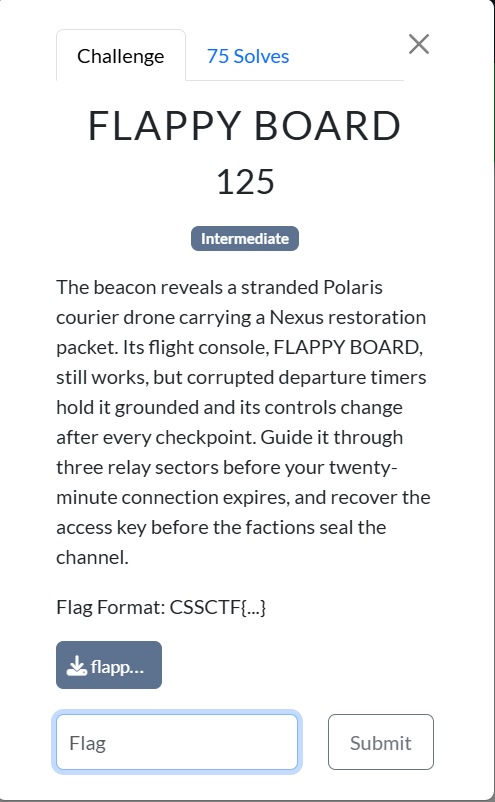

# Đề bài - flappy-board

## Nguyên văn đề

```text
FLAPPY BOARD
125
Intermediate
The beacon reveals a stranded Polaris courier drone carrying a Nexus restoration packet. Its flight console, FLAPPY BOARD, still works, but corrupted departure timers hold it grounded and its controls change after every checkpoint. Guide it through three relay sectors before your twenty-minute connection expires, and recover the access key before the factions seal the channel.

Flag Format: CSSCTF{...}

附件引用:
- 文件: C:\Users\Administrator\Downloads\flappy_board
```

Ảnh đề bài gốc, chụp từ thẻ challenge:



## Thông tin đã xác minh từ file

| Mục | Giá trị |
| --- | --- |
| Artifact | `files/flappy_board` (copy từ: `/c/Users/Administrator/Downloads/flappy_board`) |
| Kích thước | 43736 byte |
| SHA-256 | `c07bd4504d3e1d9c495aa552acbb4c10266f966c9f47a073c4707c66caf74ded` |
| Loại file | ELF 64-bit LSB pie executable, x86-64, dynamically linked, stripped |
| Entropy | 4.700/8 (không có khối payload nào, cờ không nằm trong binary) |
| Phụ thuộc | libX11 (game terminal/GUI) + libcurl; không chạy được trên máy không có X |
| Endpoint nan | `http://34.116.80.78:8765` (`.rodata` `0x8920` và `.data` `0xb060`), đổi được bằng `--server` |
| API | `POST /api/attempt`, `/api/practice`, `/api/practice/check`, `/api/complete`; body và response đều là `key=value` dạng urlencoded |
| Ràng buộc | session 1200 s; ba round có `target` = 10, 20, 30; `wait_seconds` = 180, 360, 600 |
| Nhiệm vụ | qua cả ba round để server trả `flag` trong response |
| Định dạng cờ | `CSSCTF{...}` |

## Hướng giải (tóm tắt)

Cờ nằm phía server, và server tự mô phỏng lại replay để duyệt điểm, nên bài này là bài reverse: dựng lại đúng vật lý fixed-point của client (đơn vị 1/256 px, tick 1/60 s, `xorshift32` sinh khe ống) rồi tính chuỗi tick cần flap để đạt mốc điểm của từng round. Vì mọi thứ tất định theo `seed` mà server phát ra, một beam search nhỏ trên cặp `(y, v)` là tìm được đường. Bẫy thật nằm ở thời gian: tổng `wait_seconds` của ba round đã là 1140 s trên trần 1200 s, nên chỉ được chờ đúng departure timer, không chờ thêm thời gian bay.

## Chạy lại lời giải

```bash
python exploit.py                      # dùng endpoint nan trong binary
python exploit.py --practice           # chỉ kiểm mô phỏng vật lý qua practice oracle
python exploit.py http://<host>:<port> # nếu đề cho instance khác
```

Lệnh mất khoảng 19 phút vì phải chờ ba departure timer. Kết quả: `CSSCTF{birdddd}` (đã lưu trong `flag.txt`).
