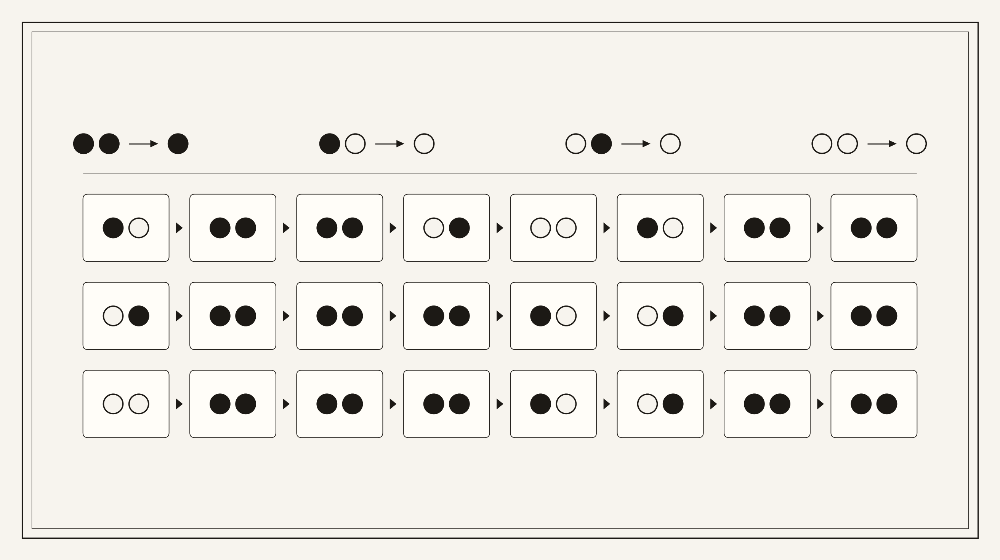

# Đề bài - lamp-drill

## Nguyên văn đề

```text
Lamp Drill
49
Warm-up. No spaces.
Dạng flag: CSSCTF{}
```

Ảnh thẻ đề:



## Thông tin đã xác minh từ file

| Mục | Giá trị |
| --- | --- |
| Artifact | `files/lampDrill.svg` (copy từ: `C:/Users/Administrator/Downloads/lampDrill.svg`) |
| Kích thước | 54671 byte |
| SHA-256 | `4a11f4a884aab46c19b94ec59de33023c58f1ab235481d01efa36d7461a2a818` |
| Loại file | SVG Scalable Vector Graphics image |
| Bản raster kèm theo | `files/lampDrill.png` (99758 byte, 2624x1472 RGBA, sha256 `37cea9a23c83deb48be6d2b583bf02b0cc930526a29c76593fa59e0118cd8184`) — cùng một nội dung, dùng làm `files/de.png` |
| Nguồn sinh SVG | `Matplotlib v3.9.2`, `dc:date` = `2026-09-30T07:31:34.743583`, `viewBox = 0 0 1180.8 662.4` |
| Nhiệm vụ | Đọc thẻ đề ra một xâu ký tự rồi bọc vào `CSSCTF{}`. |
| Định dạng cờ | `CSSCTF{...}` |

## Hướng giải (tóm tắt)

Thẻ đề có hai phần cùng kiểu vẽ (đường tròn tô màu đen hoặc màu nền). Hàng trên
là bảng chân lý của một phép toán trên hai đèn; lưới dưới là 3 hàng × 8 ô, mỗi ô
chứa đúng hai đèn. Áp bảng chân lý cho từng ô được một bit, tám ô một hàng thành
một byte (MSB trước), ba byte đọc ra chữ.

## Chạy lại lời giải

```bash
python exploit.py files/lampDrill.svg
```

Kết quả: `CSSCTF{css}` (đã lưu trong `flag.txt`).
