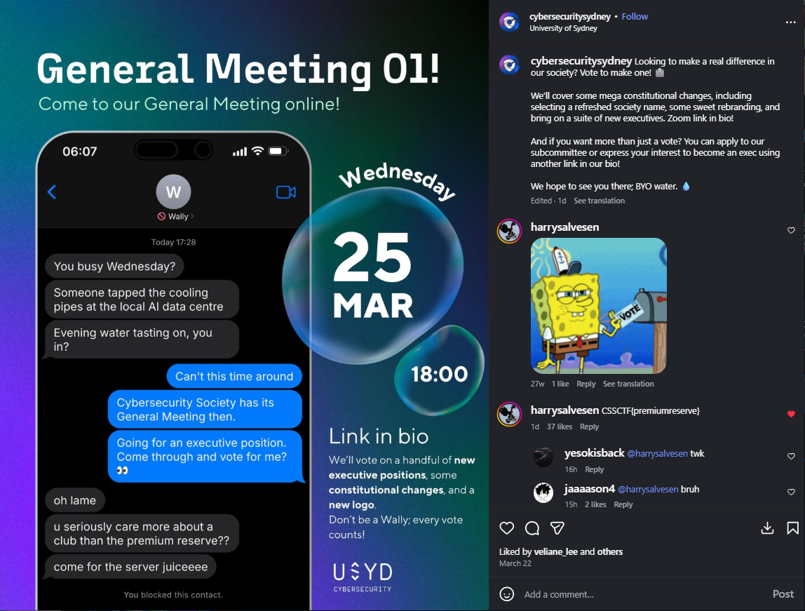
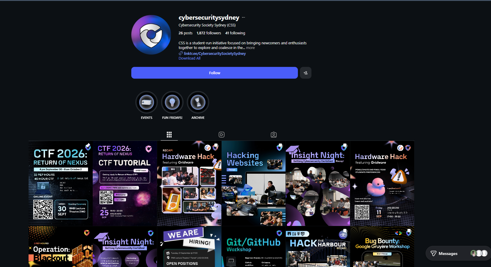

# Server Juice - OSINT (Beginner)

**Flag:** `CSSCTF{premiumreserve}`

## Cách giải

Đề bài gợi ý chúng ta theo dõi kênh mạng xã hội của cuộc thi để tìm manh mối. 

1. Tìm kiếm và truy cập vào trang Instagram chính thức của ban tổ chức sự kiện: `@cybersecuritysydney`.

   {: data-proofer-ignore="true" }

2. Trong các bài đăng trên trang, tìm bài viết có tựa đề "General Meeting 01!".
3. Đọc phần bình luận của bài viết này, chúng ta sẽ thấy một bình luận công khai từ người dùng `harrysalvesen` chứa trực tiếp flag.

   {: data-proofer-ignore="true" }

```text
harrysalvesen  8h
CSSCTF{premiumreserve}
11 likes
Reply
```

## Flag

```text
CSSCTF{premiumreserve}
```
