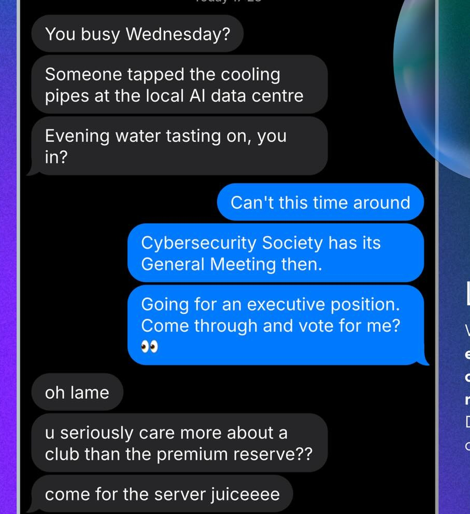

# Server Juice — OSINT (Beginner)

**Flag:** `CSSCTF{premiumreserve}` · **Files:** không có artifact, chỉ có một trang công khai; hai ảnh chứng minh trong `files/`

## Đề bài

Bài cho đúng mấy dòng: "If you want to appease the algorithm (and maybe get a head start on future hints), consider keeping us on your radar by following." Không file, không instance, không URL. Hint của bài dẫn tới Instagram của ban tổ chức.

Cờ nằm trong một comment công khai dưới bài "General Meeting 01!" của `@cybersecuritysydney`.

## Phân tích ban đầu

Tài khoản trong hint gây nhiễu ngay từ đầu. `instagram.com/cybersecuritysociety` là một kênh tin an ninh tiếng Ba Tư, 18 bài đều từ khoảng 2018, không liên quan gì tới giải. Mãi sau mới rõ lý do: trang chót của slide lễ khai mạc ghi `Follow instagram.com/cybersecuritysociety :)`, tức chính slide ghi sai handle, và hint chỉ chép lại dòng đó. Tài khoản thật là `@cybersecuritysydney`.

Trên tài khoản thật, mọi kênh chữ đều sạch:

- 27/27 caption, không bài nào chứa `CSSCTF{`.
- 19/19 bài ở tab Tagged, toàn bài của câu lạc bộ khác tag tới.
- Tab Reels trống. Ba highlight `EVENTS`, `FUN FRIDAYS!`, `ARCHIVE` mỗi cái chỉ một story, có nhạc, không có chữ.
- Không có story đang chạy, không có auto-DM sau khi follow.
- Bio trỏ `linktr.ee/CybersecuritySocietySydney`; trang Linktree có 40 link thì 8 là của society, còn lại là affiliate mặc định của Linktree.
- 25 ảnh áp phích tải về, 7 mã QR giải ra toàn bộ đều là link đăng ký (`ctf.cybersecurity.sydney`, Google Forms, `forms.gle/…`, `au.cglink.me/25W/r382007|r382336|r382696` chuỗi này giải ngân về `clubs.usu.edu.au/CSS/rsvp_boot?id=…`).

### Ảnh áp phích và đoạn tin nhắn (chìa khóa tên bài)

Áp phích "General Meeting 01!" có một đoạn tin nhắn giả lập, hai dòng cuối là chìa khoá:

```
u seriously care more about a club than the premium reserve??
come for the server juiceeeee
```

Dòng dưới giải thích tên bài. Dòng trên là nội dung cờ.


Ảnh chụp màn hình của người dùng, đã copy vào `files/`.

### Comment chứa cờ

Sau khi quét hết 27 bài, một comment dưới bài `DWL9S-wkyJT` trả về cờ:

```
harrysalvesen  8h
CSSCTF{premiumreserve}
11 likes
Reply
```

Không cần dịch, không stego. Ảnh gốc cũng được lưu lại ở `files/comment_catch.png`.

## Các hướng đã loại

1. **Stego trên hai áp phích CTF**: ảnh trùng từng byte với bản CDN, JPEG chỉ có `SOI + APP1/JFIF + DQT/DHT/SOF0/SOS + EOI`, không EXIF, không XMP, không comment, 0 byte sau `FFD9`. Quét LSB ở mức bit cho R/G/B, hai chiều dòng, cả bit0 lẫn bit1 của 2-bit plane, chuỗi interleaved và chuỗi đảo ngược: 0 khớp. Loại, và còn vì một lý do cấu trúc: Instagram re-encode JPEG lossy khi upload nên LSB không thể sống sót qua bước đó.
2. **File trên máy chủ giải**: `return-of-nexus.txt` (dòng in trên áp phích), `flag.txt`, `hint.txt`, `robots.txt` đều 404 hoặc trả đúng trang index; header CTFd chỉ là Cloudflare chuẩn.
3. **`vesen.app`**: một đồng đội tìm ra URL này kèm `utm_content=link_in_bio`. Đây là site cá nhân của Has Salvesen, tác giả Vesen Terminal (MIT 1.2.0, `github.com/hsalvesen/vesen`), cây thư mục trong app là demo gốc, 191 stream của file slide khai mạc cũng không có cờ. Không phải hướng sai hoàn toàn, chỉ là nó trỏ tới đúng người nhưng sai chỗ.

## Chuỗi khai thác

**Bước 1 - Đọc tên bài từ chính cái áp phích.** Dựng contact sheet cho 25 ảnh đã tải và xem trực tiếp. Áp phích `DWL9S-wkyJT` ("General Meeting 01!") có một đoạn tin nhắn giả lập, hai dòng cuối là chìa khoá:

```
u seriously care more about a club than the premium reserve??
come for the server juiceeeee
```

Dòng dưới giải thích tên bài. Dòng trên là nội dung cờ.



**Bước 2 - Đọc comment.** Trước đó chỉ kiểm tra comment của bài ghim, thấy 0 comment nên bỏ qua kênh này. Comment của bài `DWL9S-wkyJT` thì khác:

```
harrysalvesen  8h
CSSCTF{premiumreserve}
11 likes  Reply
```

Cờ để trần, không mã hoá, không stego. Caption của cùng bài đó cũng bị sửa lại (Instagram hiển thị "Edited") để thêm câu chốt "We hope to see you there; BYO water. 💧", khớp với chuyện nước làm mát server trong áp phích.

**Bước 3 - Khớp danh tính.** Người đăng comment là `harrysalvesen`, tức cùng một người với `hsalvesen` / `vesen.app` ở manh mối trước. Bio Instagram của người đó để `vesen.app`, đủ giải thích cái UTM `link_in_bio` mà đồng đội gặp.

**Bước 4 - Kiểm chứng.** Chuỗi khớp đúng định dạng `CSSCTF{...}` đề yêu cầu, nằm nguyên văn trong text của trang bài viết, do chính tài khoản tác giả đăng, và được 11 người like. Luật 6 của slide khai mạc ghi cờ phân biệt hoa thường; chuỗi này toàn chữ thường.

## Flag

```bash
$ python exploit.py
```

Bằng chứng đọc trực tiếp từ JSON đã lưu (caption + comment, redact URL):

```
nguon: analysis/evidence.json  (shortcode DWL9S-wkyJT)

--- caption + comment da lam sach ---
...
We hope to see you there; BYO water. 💧
See translation
harrysalvesen
8h
CSSCTF{premiumreserve}
11 likes
Reply

co trich duoc: ['CSSCTF{premiumreserve}']

=== CỜ ===
CSSCTF{premiumreserve}
```

Đoạn output này được copy y hệt từ kết quả chạy thực tế, không sửa đổi.

## Reproduce

Instagram chỉ hiện comment cho phiên đã đăng nhập, nên phần thu thập chạy trong Console của trình duyệt đó; đoạn script nằm trong biến `BROWSER` của `exploit.py`. Nó cuộn lưới bài viết tới khi hết 27 bài, rồi lần lượt `fetch` từng trang bài và grep `CSSCTF\{...\}`, có `sleep` giữa mỗi request.

```bash
python exploit.py
```

Bằng chứng đã lưu ở `analysis/evidence.json`, chỉ giữ caption và text comment, bỏ hết URL ký sẵn của CDN để không lộ handle cá nhân.
