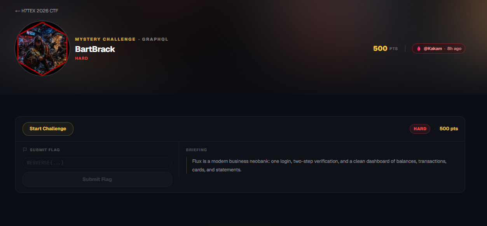
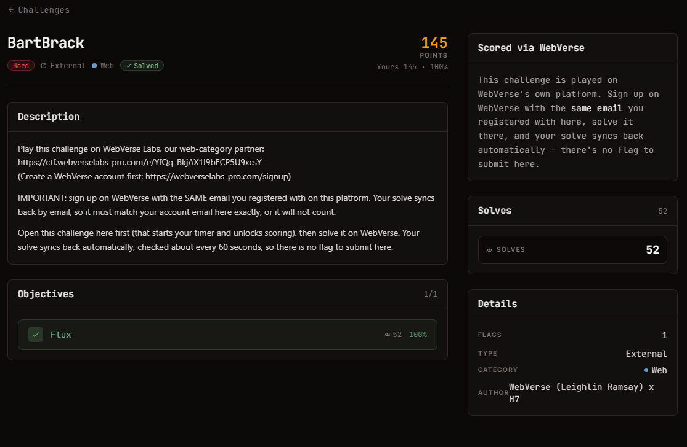

# Đề bài - BartBrack

Ảnh đề bài gốc, chụp từ thẻ challenge:




**Thể loại:** Web (GraphQL) · **Độ khó:** hard · **Điểm:** 500 (H7TEX) / 500 (WebVerse) · **Static**
**Nền tảng:** chơi trên WebVerse Labs, solve sync về H7TEX theo email (`ptdanh007`), không nộp flag ở H7TEX.
**Tag WebVerse:** `GRAPHQL` · **Author:** Kakam · **Cờ:** `WEBVERSE{...}`

## Nguyên văn đề (H7TEX)

```text
Play this challenge on WebVerse Labs, our web-category partner:
https://ctf.webverselabs-pro.com/e/YfQq-BkjAX1I9bECP5U9xcsY

IMPORTANT: sign up on WebVerse with the SAME email you registered with on this platform.
Your solve syncs back by email, so it must match your account email here exactly, or it will not count.

Open this challenge here first (that starts your timer and unlocks scoring), then solve it on
WebVerse. Your solve syncs back automatically, checked about every 60 seconds, so there is no
flag to submit here.
```

## Nguyên văn briefing (WebVerse)

```text
Flux is a modern business neobank: one login, two-step verification, and a clean dashboard
of balances, transactions, cards, and statements.
```

## Thông tin đã xác minh từ instance

| Mục | Giá trị |
| --- | --- |
| Instance | `82d6b903-5765-bartbrack-130c9.mystery-challenges.webverselabs-pro.com` (timer 2h) |
| Stack | Apache/2.4.68 (Debian), PHP/8.2.33, Cloudflare phía trước |
| Entrypoint | `/index.php` (form login POST về `/`), cookie `flux_sid` HttpOnly SameSite=Lax |
| Đăng nhập | `admin` / `admin` **đi được** -> 302 `/verify.php` |
| 2FA | code **5 chữ số** (00000-99999), trang báo "Repeated failures will lock this session" |
| GraphQL | `POST /graphql.php`, từ chối "Sign in first." khi chưa có session |
| Schema | query `status`; mutation `verifyOtp(code) -> OtpResult{ok, token}` |
| Gợi ý trong client | `/static/js/verify.js` ghi rõ: *"The endpoint is rate-limited per request; that is what an attacker bypasses with alias batching."* |

## Hướng giải (tóm tắt)

Không có đăng ký tài khoản và không có SQLi ở form login; cửa vào là **bypass 2FA**.
`/graphql.php` chỉ giới hạn theo **số request**, không theo số lần resolve, nên một mutation chứa
nhiều alias `vN: verifyOtp(code:"NNNNN")` sẽ thử hàng trăm code trong một hit. Quét hết không gian
100.000 code theo lô, lấy `token` khi `ok=true`, rồi mở `/dashboard.php` để đọc cờ.

## Chạy lại lời giải

```bash
python exploit.py https://<instance-host>
```
