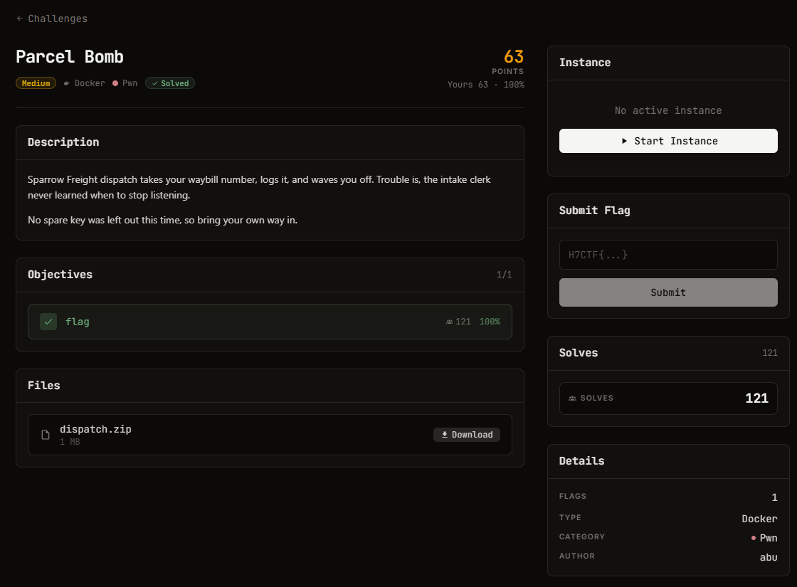

# Parcel Bomb — Pwn (Medium)

Ảnh đề bài gốc, chụp từ thẻ challenge:




## Đề (nguyên văn)

> Sparrow Freight dispatch takes your waybill number, logs it, and waves you off. Trouble is, the intake clerk never learned when to stop listening.
>
> No spare key was left out this time, so bring your own way in.

- Category: Pwn, medium, 96 points, Docker
- Remote: `nc pwn.h7tex.com 41136` (TCP)
- Files: `dispatch.zip` (1.03 MiB, sha256 `72f6e078440a9a49fbad1d25bd8b17759c55a94f230ec3405ca9fd91104a5011`)
- Objective: lấy `flag` (1 objective, flag format theo đề bài — kiểm chứng bằng regex trên bytes nhận được)

## Bundle

```
dispatch                    ELF64 EXEC, 16080 B, sha256 d946ba600ab28aec…
libc.so.6                   glibc 2.39-0ubuntu8.9 x86-64, 2129424 B
ld-linux-x86-64.so.2        236616 B
README.txt                  Ubuntu 24.04 / glibc 2.39
```

## Banner thực tế từ service

```
=== Sparrow Freight dispatch terminal ===
dispatch> enter waybill number:
```
Sau khi gửi 70 ký tự: `waybill logged.` — chuỗi khớp 100% với binary đã cho, tức instance chạy đúng file này.

## Checksec (từ triage + readelf)

| | |
| --- | --- |
| Arch | x86-64 |
| PIE | **no** (ET_EXEC, base 0x400000) |
| RELRO | **Full** (GNU_RELRO phủ `.dynamic/.got/.got.plt` 0x403df8–0x404000) |
| NX | on (GNU_STACK RW) |
| Canary | **không** (không có `__stack_chk_fail` trong symtab) |
| PLT | chỉ `puts`, `read`, `setvbuf`, `__libc_start_main` → **không có `system`, không có chuỗi `/bin/sh`** = "no spare key" |

## Code đã dịch ngược (`dispatch.c`, objdump -M intel)

```asm
0x401176 <pop_rdi_ret>:  pop rdi ; ret          ; gadget cố tình nhúng sẵn
0x401177 <ret>:          ret                     ; lấy miễn phí từ gadget trên

vuln @0x401178:
  push rbp; mov rbp,rsp; sub rsp,0x40
  lea rax,[rip+0xe7d] -> 0x402008 "dispatch> enter waybill number:"
  call puts@plt
  lea rax,[rbp-0x40]
  mov edx,0x200        ; << 512 byte
  mov edi,0            ; fd = stdin
  call read@plt        ; << overflow
  lea rax,[rip+0xe78] -> 0x402028 "waybill logged."
  call puts@plt
  leave; ret

main @0x4011bb:
  setvbuf(stdout, 0, _IONBF(2), 0)   ; stdout không đệm -> leak trả về ngay
  puts("=== Sparrow Freight dispatch terminal ===")
  call vuln
```

`stdout` (symbol 0x404028) là con trỏ sang `_IO_2_1_stdout_` trong libc, nằm **ngoài** vùng RELRO (0x404028 > 0x403fff) → về lý thuyết ghi được, nhưng không cần.

## Offset đã rút ra từ libc.so.6 của đề

| ký hiệu | offset |
| --- | --- |
| `puts` | `0x87cc0` |
| `system` | `0x58750` |
| `execve` | `0xef030` |
| `fgets` | `0x85c10` |
| `"/bin/sh"` | `0x1cc42f` |

## Điểm khoá (đây mới là "bug" của đề)

1. `read` cho 512 byte vào buffer 64 byte, **không canary**, một lần duy nhất, **không có lệnh in nội dung buffer** → không tự thân nào leak được libc.
2. Không PIE → mọi gadget/địa chỉ trong `dispatch` đã biết trước; Full RELRO → không sửa GOT được; NX → không shellcode.
3. Hướng đi: **ROP hai stage trong cùng một payload** — stage 1 dùng `pop_rdi_ret` + `puts@plt` in chính GOT slot đã resolve của `puts` (0x404000) để lấy libc base, rồi `ret` về `vuln` (0x401178) để overflow lần hai; stage 2 dùng libc base vừa leak gọi `system("/bin/sh")`.
4. Căn chỉnh stack: tại `ret` của `vuln`, `rsp ≡ 0 (mod 16)` **sau khi** pop địa chỉ trả về đầu tiên, nên mỗi gadget `pop_rdi_ret` làm lệch 8 byte. Dùng một `ret` (0x401177) chèn trước `puts@plt` để đưa `rsp ≡ 8 (mod 16)` ở đầu callee, tránh `movaps` của printf làm crash.
