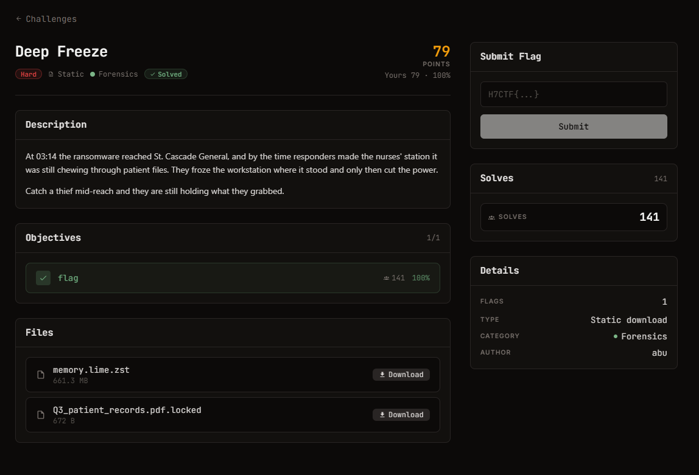

# Deep Freeze — Forensics (Hard)

Ảnh đề bài gốc, chụp từ thẻ challenge:



**Thể loại:** Forensics (memory) · **Độ khó:** hard · **Điểm:** 500 · **Static**

## Challenge Text

```text
At 03:14 the ransomware reached St. Cascade General, and by the time responders made the
nurses' station it was still chewing through patient files. They froze the workstation
where it stood and only then cut the power.

Catch a thief mid-reach and they are still holding what they grabbed.

Objectives: flag
Files: memory.lime.zst (661.3 MB), Q3_patient_records.pdf.locked (672 B)
```

## Verified Metadata

| Field | Value |
| --- | --- |
| `files/Q3_patient_records.pdf.locked` | 672 byte, sha256 `5b8701fa1b328ac8c2e53bf4b7485a7af49c984a738372061dabad4a3a274d6b` |
| File Type (`.locked`) | dữ liệu ngẫu nhiên, entropy 7.681/8, không có magic nào |
| `memory.lime.zst` (bản gốc trong `Downloads`, 1.438.796.330 B) | sha256 `dcd7cb45b26d0e7fd52734d675168a7dcb1909e16acf78ad358fe398c36b8810` |
| Sau khi giải nén | 17.175.761.051 B = 16.00 GiB, đúng bằng `Frame_Content_Size` trong header zstd |
| Định dạng ảnh bộ nhớ | LiME v1, 5 region `raw`: `0x1000-0x54ffe`, `0x100000-0xbd2f7ffe`, `0xbd305000-0xbf8ecffe`, `0xbfbff000-0xbffdfffe`, `0x100000000-0x43ffffffe` |
| Objective | lấy lại nội dung file bị mã hoá từ RAM của máy đã bị đóng băng |
| Flag Format | `H7CTF{...}` |

## Approach Summary

Ransomware giữ key + IV sống trong heap của chính nó (máy bị freeze trước khi process bị giết).
16 byte đầu file `.locked` là IV CBC; tìm đúng 16 byte IV đó trong dump, rồi quét các cửa sổ 32 byte
quanh nó bằng oracle known-plaintext `D_K(C1) == P1 ^ IV` (với `P1 = "%PDF-1.4\n1 0 obj"`).
Key tìm đượcgiải mã ra một PDF hoàn chỉnh chứa cờ.

## Reproduce

```bash
# 1) giải nén zstd (không cần cài gì, dùng libzstd.dll của Git qua ctypes)
python analysis/zstd_ctypes.py ../../_scratch/memory.lime.zst ../../_scratch/memory.raw
# 2) recover key + decrypt
python exploit.py ../../_scratch/memory.raw files/Q3_patient_records.pdf.locked
```

Kết quả: `H7CTF{bf3a8e98115450c654b4}` (đã lưu trong `flag.txt`, PDF giải mã trong `recovered.pdf`).

> Ảnh bộ nhớ 16 GiB để ngoài thư mục writeup (`_scratch/memory.raw`) cho nặng repo;
> sinh lại bằng lệnh ở bước 1 từ file `.zst` gốc.
