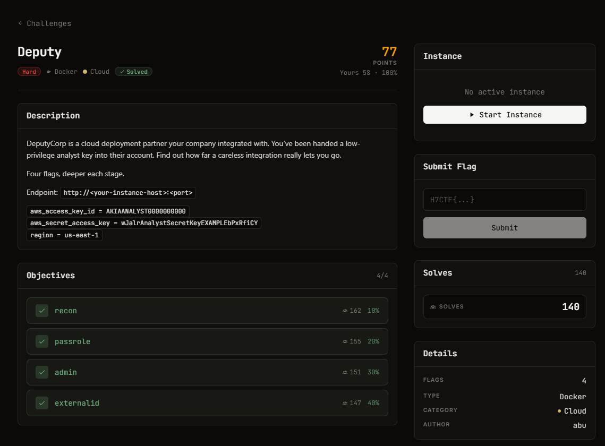

# Deputy — Cloud (Hard)

Ảnh đề bài gốc, chụp từ thẻ challenge:



## Đề (nguyên văn)

> DeputyCorp is a cloud deployment partner your company integrated with. You've been handed a low-privilege analyst key into their account. Find out how far a careless integration really lets you go.
>
> Four flags, deeper each stage.

- Category: Cloud, hard, 123 points, Docker
- Instance: `https://web-d8f0b09a99a6a969.web.h7tex.com`
- Credentials cho trước:
  ```
  aws_access_key_id     = AKIAANALYST0000000000
  aws_secret_access_key = wJalrAnalystSecretKeyEXAMPLEbPxRfiCY
  region                = us-east-1
  ```
- Objectives: `recon` (70, 10%) · `passrole` (66, 20%) · `admin` (64, 30%) · `externalid` (65, 40%)

## Bốn cờ

| stage | cờ | lấy được nhờ |
| --- | --- | --- |
| recon | `H7CTF{d6cc592f5a2f3db80718}` | `s3://deputy-analyst-scratch/welcome.txt` (analyst có `s3:GetObject` bucket này) |
| passrole | `H7CTF{28f87391f8a228110839}` | `s3://deputy-runner-logs/build.log`, chỉ đọc được khi chạy với identity của `ci-runner-role` |
| admin | `H7CTF{ea3e1dba8012d76e2648}` | `s3://deputy-flag-vault/flag`, đọc được sau khi AssumeRole `partner-admin-role` |
| externalid | `H7CTF{1dbe909840d15aabdd63}` | `s3://deputy-crown-vault/flag`, chỉ mở bởi `partner-secure-role` (cần ExternalId) |

## Phát hiện về mock endpoint

| tính chất | chi tiết |
| --- | --- |
| server | `Werkzeug/3.1.8 Python/3.12.14` |
| route | `POST /` là dispatcher theo tham số `Action` (STS + IAM). `GET /<segment>` được hiểu là **S3 path-style**: bucket = segment đầu tiên (`GET /deputy-analyst-scratch`, `GET /<bucket>/<key>`) |
| Lambda | REST API thật: `GET/POST /2015-03-31/functions`, `POST /2015-03-31/functions/<name>/invocations` |
| **chữ ký** | **không verify SigV4**: chỉ parse access key id từ header `Authorization: AWS4-HMAC-SHA256 Credential=<AK>/...` và session token từ `X-Amz-Security-Token` |
| authz | mock áp đúng inline policy của identity tương ứng, nên mỗi stage phải dùng đúng credentials của stage đó |
| action lạ | `400 InvalidAction: unsupported sts action X` hoặc `unsupported action X` |

Không có `boto3` trên host, cũng không cần: `analysis/awsclient.py` là client ~40 dòng dùng `requests`.

## Policy của hai identity gốc (đọc bằng `iam:GetUserPolicy` / `iam:GetRolePolicy`)

`analyst-permissions` (inline của user `analyst`):
```json
{"Statement": [
 {"Effect":"Allow","Action":["sts:GetCallerIdentity"],"Resource":"*"},
 {"Effect":"Allow","Action":["iam:Get*","iam:List*"],"Resource":"*"},
 {"Effect":"Allow","Action":["s3:ListAllMyBuckets"],"Resource":"*"},
 {"Effect":"Allow","Action":["lambda:CreateFunction","lambda:InvokeFunction",
                             "lambda:GetFunction","lambda:ListFunctions"],"Resource":"*"},
 {"Effect":"Allow","Action":["iam:PassRole"],
  "Resource":"arn:aws:iam::111111111111:role/ci-runner-role"},
 {"Effect":"Allow","Action":["s3:GetObject","s3:ListBucket"],
  "Resource":["arn:aws:s3:::deputy-analyst-scratch","arn:aws:s3:::deputy-analyst-scratch/*"]}]}
```

`ci-runner-permissions` (inline của role `ci-runner-role`):
```json
{"Statement": [
 {"Effect":"Allow","Action":["sts:AssumeRole"],
  "Resource":"arn:aws:iam::999999999999:role/partner-admin-role"},
 {"Effect":"Allow","Action":["s3:GetObject","s3:ListBucket"],
  "Resource":["arn:aws:s3:::deputy-runner-logs","arn:aws:s3:::deputy-runner-logs/*"]},
 {"Effect":"Allow","Action":["logs:*"],"Resource":"*"}]}
```

Trust policy của `ci-runner-role`: `Principal.Service = lambda.amazonaws.com` -> chỉ Lambda được assume nó.
