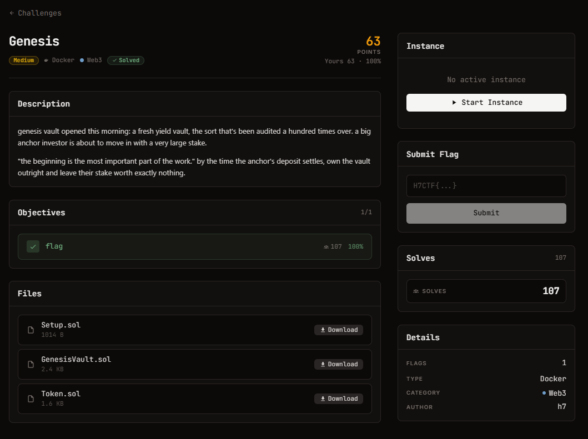

# Genesis — Web3 (Medium)

Ảnh đề bài gốc, chụp từ thẻ challenge:



## Challenge Text

```text
Genesis - medium - Web3 - 89 điểm

genesis vault opened this morning: a fresh yield vault, the sort that's been audited a
hundred times over. a big anchor investor is about to move in with a very large stake.

"the beginning is the most important part of the work." by the time the anchor's deposit
settles, own the vault outright and leave their stake worth exactly nothing.

Objectives: 1 flag
Files: Setup.sol GenesisVault.sol Token.sol
Instance: https://web-a51c34fe922c90e8.web.h7tex.com
```

## Thông tin đã xác minh

| Field | Value |
| --- | --- |
| Artifact | `files/Setup.sol`, `files/GenesisVault.sol`, `files/Token.sol` (Solidity 0.8.24) |
| Instance | `GET /` trả rpc endpoint (POST cùng URL), chain id 31337, private key player, địa chỉ Setup |
| Setup | `0xD393844Da0Fa5EaDC271929623B82f3B8f4E3efd` (instance đã hết hạn) |
| Player / Vault / Token | `0x830078bC5a6a29d99DDBA1DffD8a2FF5964AD7Df` / `0x7358f0D34A6Ec82F2a5f0Cb13a7877C322DC4E49` / `0xDf024721999b55f63eF812b17CC5A9cecec46ea6` |
| Objective | `victimDeposited && vault.balanceOf(victim) == 0 && token.balanceOf(vault) < 1 ether` |
| Flag Format | `H7CTF{uuid}`, lấy bằng `GET /flag` |

Player có 200 gUSD và rất nhiều ETH. `victim` chỉ là hằng số `address(0xC0FFEE)`, còn
`Setup.victimDeposit()` là `external` không phân quyền: ai cũng bấm được cho anchor.

## Approach Summary

ERC4626 share-inflation. `convertToShares` chia cho `reserve` mà không có virtual
share/asset nào, và `sync()` công khai lấy thẳng số dư token của vault làm reserve. Gửi
1 wei để thành holder duy nhất, donate toàn bộ 200 gUSD rồi `sync()` để một share có giá
200 gUSD, bấm `victimDeposit()` để 100 gUSD của anchor làm tròn xuống 0 share, cuối cùng
redeem 1 share ăn hết 300 gUSD.

## Reproduce

```bash
npm i ethers@6
node solve.mjs
```

Kết quả: `H7CTF{346df380-9ca8-41a7-8853-5a6f23c601ad}` (đã lưu trong `flag.txt`).
