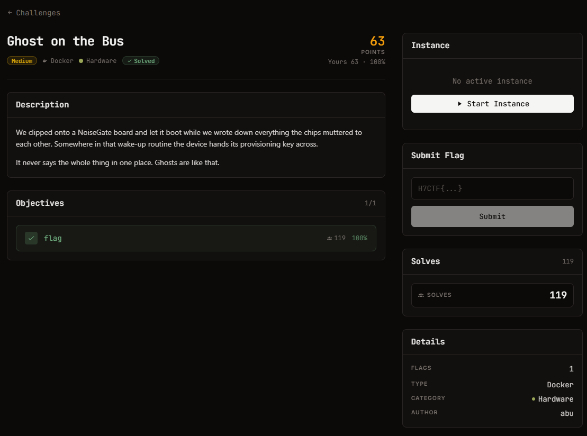

# Ghost on the Bus — Hardware (Medium)

Ảnh đề bài gốc, chụp từ thẻ challenge:



## Đề (nguyên văn)

> We clipped onto a NoiseGate board and let it boot while we wrote down everything the chips muttered to each other. Somewhere in that wake-up routine the device hands its provisioning key across.
>
> It never says the whole thing in one place. Ghosts are like that.

- Category: Hardware, medium, 112 points, Docker
- Instance: `https://web-c2656e4339a3659c.web.h7tex.com` (HTTP :443)
- Objective: 1 flag

## Lưu ý về lần probe 404 đầu tiên

Lần fetch đầu tôi gõ nhầm hostname thành `web-c2650c9b0e3d0251` (sai 12/16 ký tự hex). Host sai vẫn phân giải được (wildcard DNS của platform) và front router trả `404 page not found` kiểu Go, nên tôi kết luận sai là "instance chết". Với hostname đúng, mọi thứ trả 200 ngay. Không có chuyện instance không chạy.

## Index page

```
$ curl -sS https://web-c2656e4339a3659c.web.h7tex.com/
<h1>NoiseGate boot capture</h1>
<p>8-channel logic capture of the device boot (2 MHz). Open in PulseView / sigrok.</p>
<p>Channels: UART_TX, SCL, SDA, SPI_CLK, SPI_MOSI, SPI_MISO, SPI_CS, AUX</p>
<ul><li><a href="capture.vcd">capture.vcd</a></li></ul>
```

`Server: SimpleHTTP/0.6 Python/3.11.16`, chỉ phục vụ đúng một file.

## Artifact

```
capture.vcd   44626 B   7059 dòng   timescale 1ns   kết thúc ở 29.790 ms
$var: !=UART_TX  "=SCL  #=SDA  $=SPI_CLK  %=SPI_MOSI  &=SPI_MISO  '=SPI_CS  (=AUX
```

## Nhịp từng bus, đo từ chính file

| kênh | số transition | nhịp suy ra |
| --- | --- | --- |
| UART_TX | 1685 | bit = **8500 ns** (logic 2 MHz -> 17 mẫu/bit, ~117650 baud), histogram gap: 8500/17000/25500/34000 |
| SCL | 795 | chu kỳ 12500 ns (low 5000 / high 7500) -> **I2C 80 kHz** |
| SDA | 197 | gap là bội số 12500 ns -> khớp SCL |
| SPI_CLK | 753 | gap 1000 ns đều -> chu kỳ 2000 ns = **500 kHz**, idle low (CPOL=0) |
| SPI_CS | 3 | 1 transaction, low từ 22984000 đến 23738000 ns = 754 µs = 376 clock = 47 byte |
| SPI_MOSI | 8 | gần như tĩnh -> chỉ có 4 byte lệnh |
| SPI_MISO | 177 | dữ liệu trả về |
| AUX | 1 (chỉ giá trị khởi tạo) | luôn mức 1, kênh chết |
