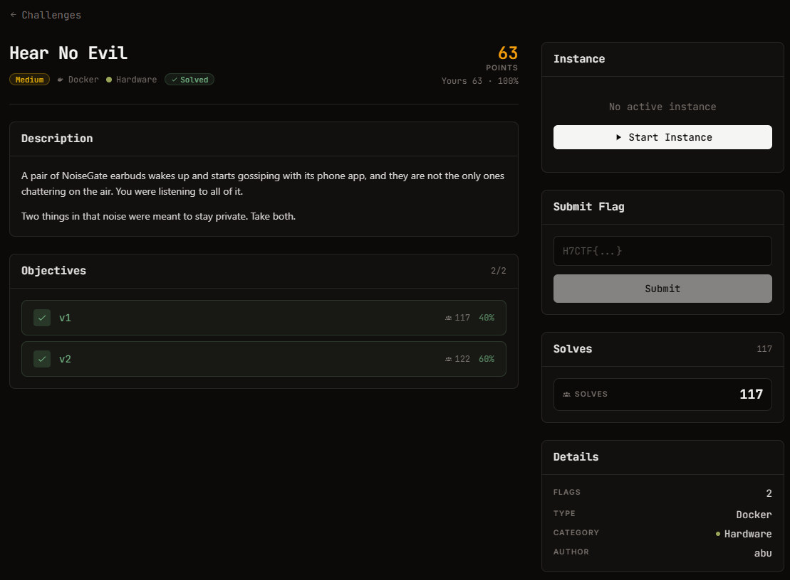

# Hear No Evil — Hardware (Medium)

Ảnh đề bài gốc, chụp từ thẻ challenge:



## Đề bài (nguyên văn)

```
Hear No Evil
medium
Docker
Hardware
130

Points

Description
A pair of NoiseGate earbuds wakes up and starts gossiping with its phone app, and they are not the only ones chattering on the air. You were listening to all of it.

Two things in that noise were meant to stay private. Take both.

Objectives
0/2
1
v1
17
40%
2
v2
18
60%
Instance
Running
Session
Connect

The service can take a few seconds to start after launch. If it does not respond, wait a moment and retry.

HTTP
:443
https://web-2c53753bcbf2c207.web.h7tex.com

Time left

29m 56s

Extensions

0/ 2
```

## Intake

| Field | Value |
| --- | --- |
| Challenge | Hear No Evil |
| Category | Hardware, medium, 130 pts, 2 objective (v1 40%, v2 60%) |
| Đích | `https://web-2c53753bcbf2c207.web.h7tex.com` (`Python SimpleHTTP/0.6`) |
| Artifact | `/capture.pcap` — 2220 B, 50 packet, pcap magic `d4c3b2a1`, DLT ghi là 251 |
| Flag | `H7CTF{...}`, hai giá trị |
