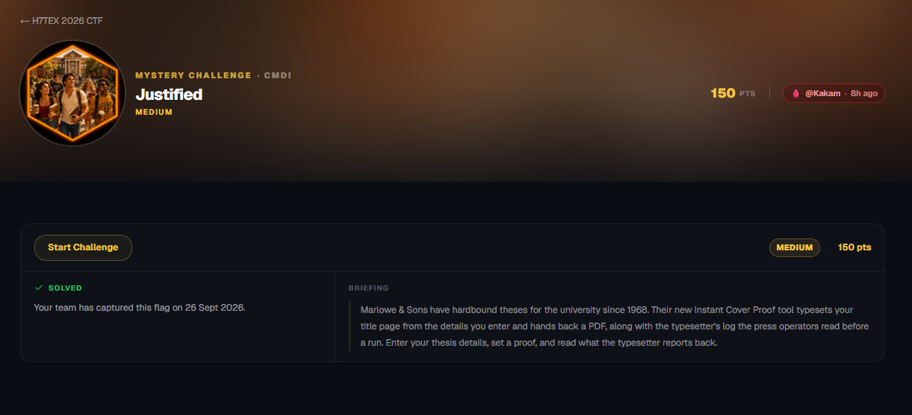
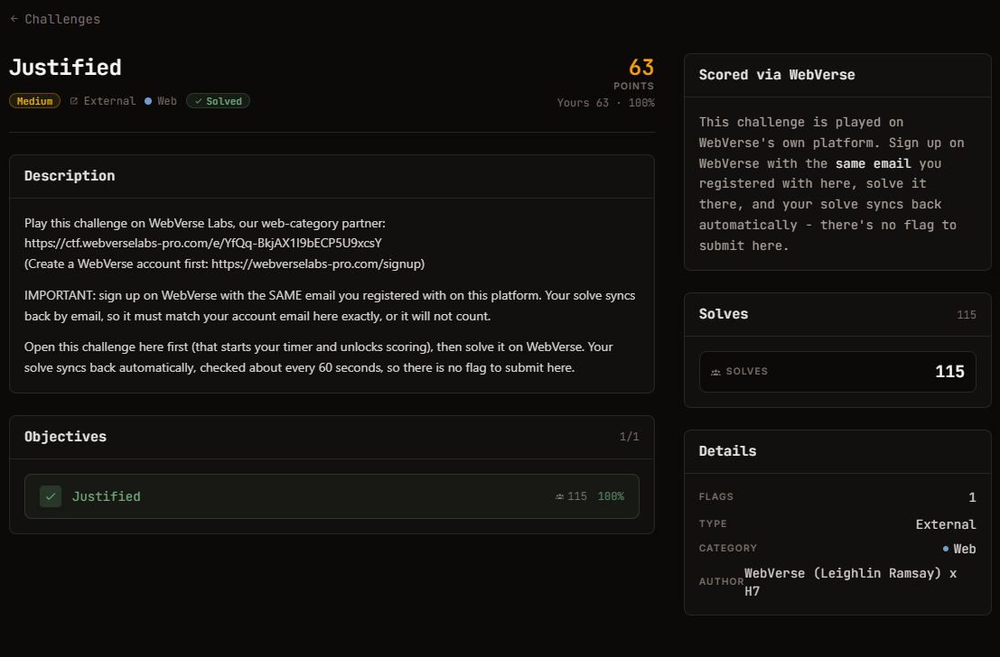

# Justified - Web (Medium)

Ảnh đề bài gốc, chụp từ thẻ challenge:




**Thể loại:** Web (CMDI) · **Độ khó:** medium · **Điểm:** 150 · **Nền tảng:** WebVerse Labs
**Tag WebVerse:** `CMDI` · **Author:** Kakam · **Cờ:** `WEBVERSE{...}`
**Instance:** `978870f9-5765-justified-06d98.mystery-challenges.webverselabs-pro.com`

## Nguyên văn đề (WebVerse briefing)

```text
Marlowe & Sons have hardbound theses for the university since 1968. Their new Instant Cover
Proof tool typesets your title page from the details you enter and hands back a PDF, along
with the typesetter's log the press operators read before a run. Enter your thesis details,
set a proof, and read what the typesetter reports back.
```

## Thông tin đã xác minh

| Field | Value |
| --- | --- |
| Trang đích | `POST /proof.php` (không cần tài khoản) |
| Field | `title`, `author`, `degree`, `department`, `institution`, `supervisor`, `year`, `abstract`, `reference` |
| Engine | `pdfTeX ... (TeX Live 2025/dev/Debian)`, chạy với **`\write18 enabled.`** (shell escape đầy đủ, không restricted) |
| Đầu ra | PDF + **log của pdflatex được in nguyên văn** vào `<pre>` trên trang |
| `reference` | bị sanitize về `[A-Za-z0-9_-]` (mọi payload shell đều bị strip, `ref1;id` -> jobname `ref1id`) |
| `title` | **không lọc**, được ghép thẳng vào `main.tex` (đề còn chủ động gợi ý "nhập ký tự LaTeX kiểu `M\"uller`") |
| Gợi ý LaTeX trong UI | chính là chữ ký của LaTeX injection |

## Approach Summary

Không có command injection theo nghĩa shell ở `reference`; đường thật là **LaTeX injection** trong `title`:
`\immediate\write18{...}` thực thi shell vì shell escape được bật.
Để lấy kết quả, redirect stdout của lệnh sang **stderr** (`1>&2`) - stderr của pdflatex được ghi vào log
mà trang web hiển thị lại, nên đây là kênh đọc dữ liệu kín mà không cần sửa PDF.

## Reproduce

```bash
python exploit.py https://<instance-host>            # mặc định: cat /flag.txt
python exploit.py https://<instance-host> "ls -la /app"
```

Đã kiểm chứng: `WEBVERSE{d5f60724dc9f1197140001fa4b24198e}` (nộp thành công, trang WebVerse hiện SOLVED).
