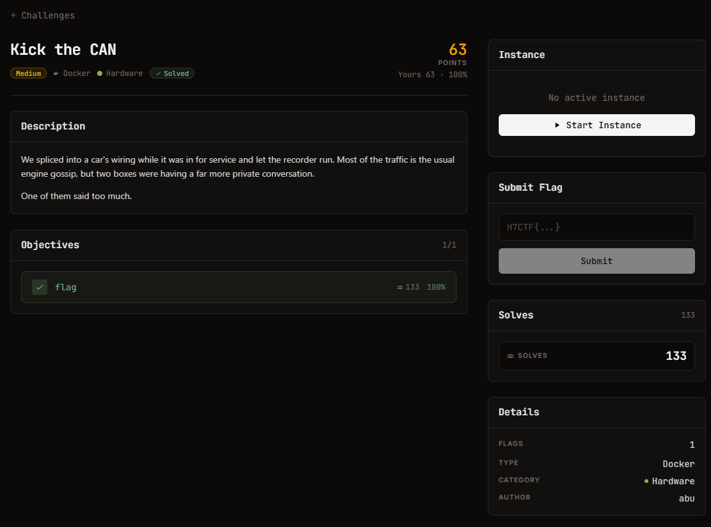

# Kick the CAN — Hardware (medium), 125 pts

Ảnh đề bài gốc, chụp từ thẻ challenge:



## Đề bài (nguyên văn)

```
Kick the CAN
medium
Docker
Hardware
125

Points

Description
We spliced into a car's wiring while it was in for service and let the recorder run. Most of the traffic is the usual engine gossip, but two boxes were having a far more private conversation.

One of them said too much.

Objectives
0/1
1
flag
19
100%
Instance
Running
Session
Connect

The service can take a few seconds to start after launch. If it does not respond, wait a moment and retry.

HTTP
:443
https://web-5c6688f7ad7feac6.web.h7tex.com

Time left

29m 56s

Extensions

0/ 2

Extend
https://web-5c6688f7ad7feac6.web.h7tex.com
```

## Intake

| Mục | Giá trị |
| --- | --- |
| Challenge | Kick the CAN |
| Category | Hardware, medium, 125 pts |
| Đích | `https://web-5c6688f7ad7feac6.web.h7tex.com` (Python `SimpleHTTP/0.6 Python/3.11.16`) |
| Artifact | `GET /capture.log` → 132 dòng candump, 5248 byte, lưu ở `analysis/capture.log` |
| Định dạng log | `(timestamp) can0 <HEXID>#<HEXDATA>` |
| Flag | `H7CTF{...}` |
