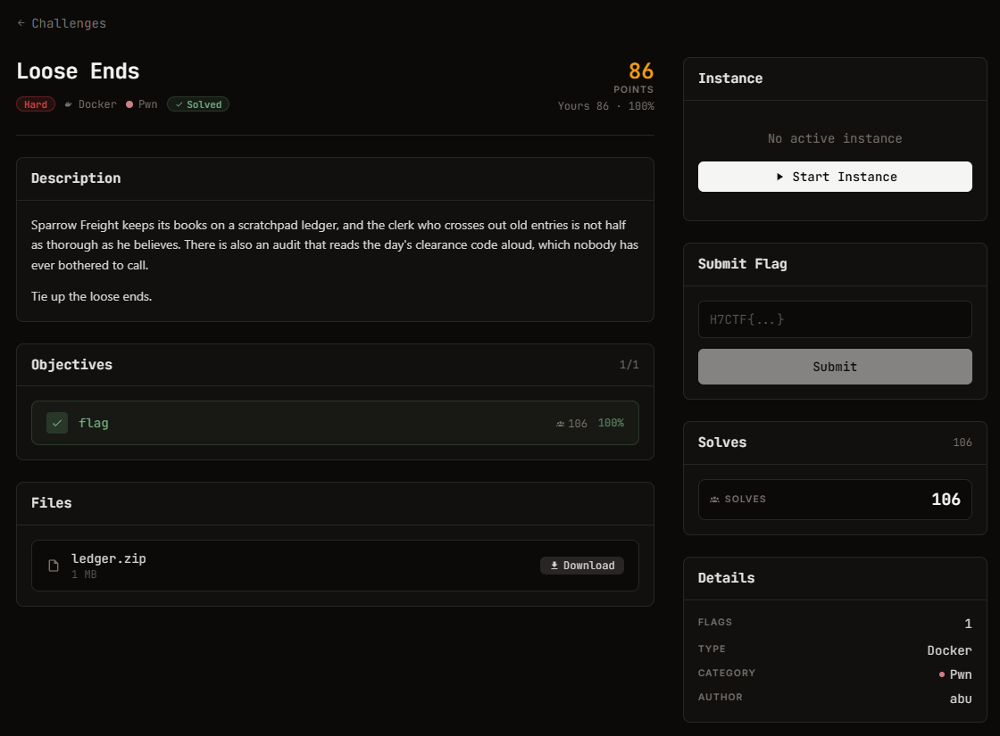

# Loose Ends — Pwn (Hard)

Ảnh đề bài gốc, chụp từ thẻ challenge:



## Đề bài (nguyên văn)

```
Loose Ends
hard
Docker
Pwn
248

Points

Description
Sparrow Freight keeps its books on a scratchpad ledger, and the clerk who crosses out old entries is not half as thorough as he believes. There is also an audit that reads the day's clearance code aloud, which nobody has ever bothered to call.

Tie up the loose ends.

Objectives
0/1
1
flag
26
100%
Files
ledger.zip

1 MB

Download
Instance
Running
Session
Connect

The service can take a few seconds to start after launch. If it does not respond, wait a moment and retry.

TCP
:42589
nc pwn.h7tex.com 42589

Time left

59m 18s

Extensions

0/ 4
```

## Intake

| Field | Value |
| --- | --- |
| Artefact | `files/ledger.zip` — 1077634 B, sha256 `26e8a464...ca81c1726` |
| Bên trong | `ledger` (ELF x86-64 16680 B, sha256 `55c19caf7d6630c7`), `libc.so.6`, `ld-linux-x86-64.so.2`, `README.txt` |
| Target | Ubuntu 24.04, glibc 2.39-0ubuntu8.9 |
| Remote | `pwn.h7tex.com:42589` |
| Flag | `H7CTF{...}` |

## Mitigation

```
ET_EXEC, no PIE | NX on | STACK non-exec
GNU_RELRO: 0x403df8 .. 0x404000   -> CHỈ phủ tới 0x404000
.got.plt 0x403fe8 +0x80, các JUMP_SLOT của hàm ở 0x404000..0x404060  -> GHI ĐƯỢC
__stack_chk_fail có mặt -> menu/idx/audit có canary
```
