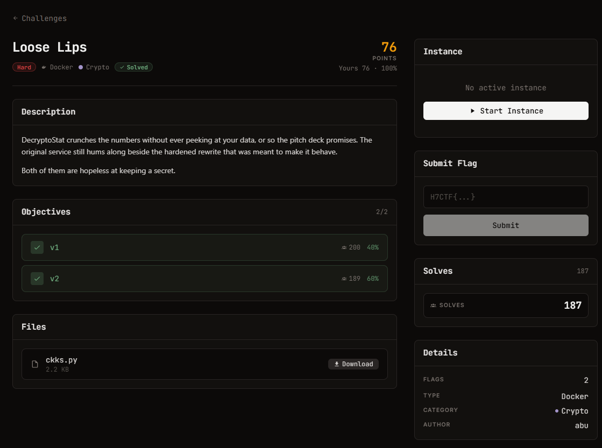

# Loose Lips - Crypto (hard, 98 điểm, 2 objectives)

Ảnh đề bài gốc, chụp từ thẻ challenge:



## Đề (nguyên văn)

> DecryptoStat crunches the numbers without ever peeking at your data, or so the pitch deck promises. The original service still hums along beside the hardened rewrite that was meant to make it behave.
>
> Both of them are hopeless at keeping a secret.

- Category: Crypto, hard, 98 points, Docker
- Objectives: **v1** (93 điểm, 40% solve) và **v2** (86 điểm, 60% solve)
- Instance: `https://web-550a48e366fd77e3.web.h7tex.com`
- Files: `ckks.py` (2272 B, sha256 `f905e01981fc8049…`)

## Index page (GET / trả JSON, `Server: BaseHTTP/0.6 Python/3.11.16`)

```json
{"service": "DecryptoStat privacy-preserving analytics",
 "scheme": "CKKS-style approximate HE (see ckks.py): N=8, Q=1099511627689, DELTA=33554432",
 "endpoints": {
   "POST /v1/encrypt {values}": "encrypt a length-4 vector; returns id + ciphertext (b, a)",
   "POST /v1/decrypt {id}": "approximate decryption of an issued ciphertext (decoded slots)",
   "POST /v1/recover {s}": "submit the v1 secret key to claim flag 1",
   "POST /v2/encrypt {values}": "same, hardened service",
   "POST /v2/decrypt {id}": "decryption with noise flooding",
   "POST /v2/recover {s}": "submit the v2 secret key to claim flag 2"},
 "note": "the secret key is a length-8 ternary vector"}
```

## Chương trình đề cho (`files/ckks.py`, phần lõi)

```python
N = 8;  Q = (1 << 40) - 87;  DELTA = 1 << 25
def small(bound=1): return [secrets.randbelow(2*bound+1) - bound for _ in range(N)]
def keygen(): return small(1)                     # ternary
def encrypt(values, s):
    m = encode(values); a = rand_poly(); e = small(3)
    b = ring_add(ring_sub([0]*N, ring_mul(a, s)), ring_add(m, e))   # b = -a*s + m + e
    return b, a
def decrypt(ct, s, smudge=0):
    d = ring_add(b, ring_mul(a, s))               # = m + e
    if smudge: d = ring_add(d, small(smudge))     # noise flooding ở v2
    return decode(d)
```

## Hai kết quả

| objective | secret key recover được | flag |
| --- | --- | --- |
| v1 | `[1, -1, 0, -1, 1, 1, -1, -1]` | `H7CTF{08a5c5eb-7571-4a3d-a80d-599ddd46c5ad}` |
| v2 | `[1, 0, 0, -1, -1, -1, 0, 1]` | `H7CTF{89c0e6b2-9fca-49fd-a02f-07a70e359363}` |
