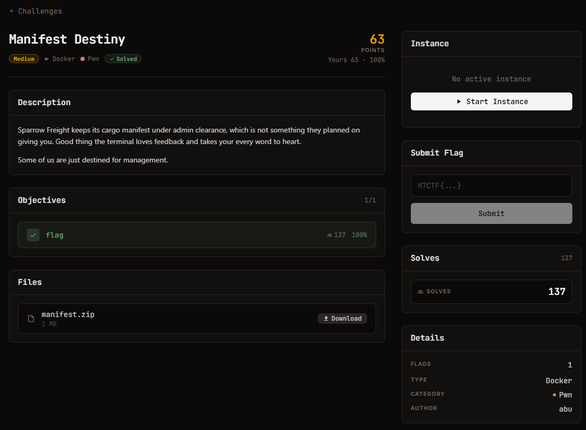

# Manifest Destiny - Pwn (Medium)

Ảnh đề bài gốc, chụp từ thẻ challenge:



**Thể loại:** Pwn (format string) · **Độ khó:** medium · **Điểm:** 74-75 · **Docker** (live)
**Target:** `nc pwn.h7tex.com 42506` (port đổi theo phiên) · **Cờ:** `H7CTF{...}`

## Challenge Text

```text
Sparrow Freight keeps its cargo manifest under admin clearance, which is not something they
planned on giving you. Good thing the terminal loves feedback and takes your every word to
heart.

Some of us are just destined for management.
```

Hai câu gợi ý: "loves feedback / takes your every word to heart" = input được **in lại qua
`printf`**, tức format string; "destined for management" = đổi biến phân quyền.

## File cho trước

`files/manifest.zip` (1 MB) gồm:

| File | Size | Ghi chú |
| --- | --- | --- |
| `files/manifest` | 16.464 B, sha256 `db581eff3b92bc55...` | ELF 64-bit, **ET_EXEC (no PIE)**, NX, RELRO, dynamically linked |
| `libc.so.6` | 2.129.424 B | glibc 2.39 (Ubuntu 24.04) - khớp bản target chạy |
| `ld-linux-x86-64.so.2` | 236.616 B | loader kèm theo |
| `README.txt` | 585 B | hướng dẫn chạy local bằng `ld-linux ... --library-path` |

## Phân tích tĩnh nhanh

```
main:        fgets(16) -> atoi;  1 -> feedback(), 2 -> view_manifest(), khác -> thoát
feedback:    char buf[208] ở rbp-0xd0; memset; read(0, buf, 0xc7);
             printf("You said: "); printf(buf);        <-- FORMAT STRING, buf == rsp
view_manifest: if (!is_admin) "admin clearance required";
               else fopen("...", "r"); fgets(128); printf("[manifest] clearance code: %s", ...)
```

`is_admin` là DWORD trong `.bss` tại **`0x40407c`**; binary không PIE nên địa chỉ cố định.

## Approach Summary

Vì buffer nằm chính xác tại `rsp` lúc gọi `printf`, nó là vararg đầu tiên trên stack =
đối số thứ 6 (`%6$`), còn `buf+8` là đối số thứ 7. Đặt địa chỉ `0x40407c` vào `buf+8` rồi
dùng `%7$n` sẽ ghi số ký tự đã in vào thẳng biến quyền. Chỉ cần giá khác 0 là qua kiểm tra,
nên 4 ký tự in trước là đủ.

## Reproduce

```bash
python exploit.py pwn.h7tex.com <port>
```

Kết quả: `H7CTF{a2b24085-c670-4a87-93cb-293cfec6196c}` (đã verify bằng chính script đã đóng gói).
