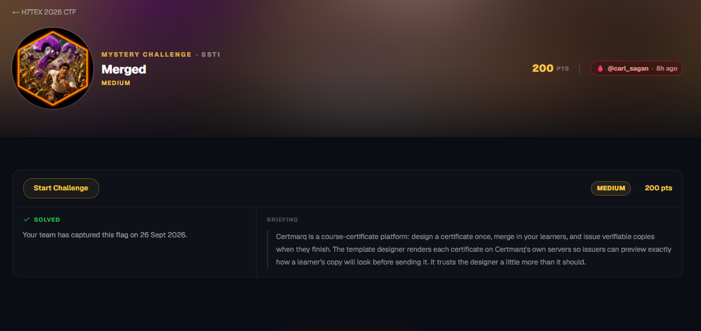
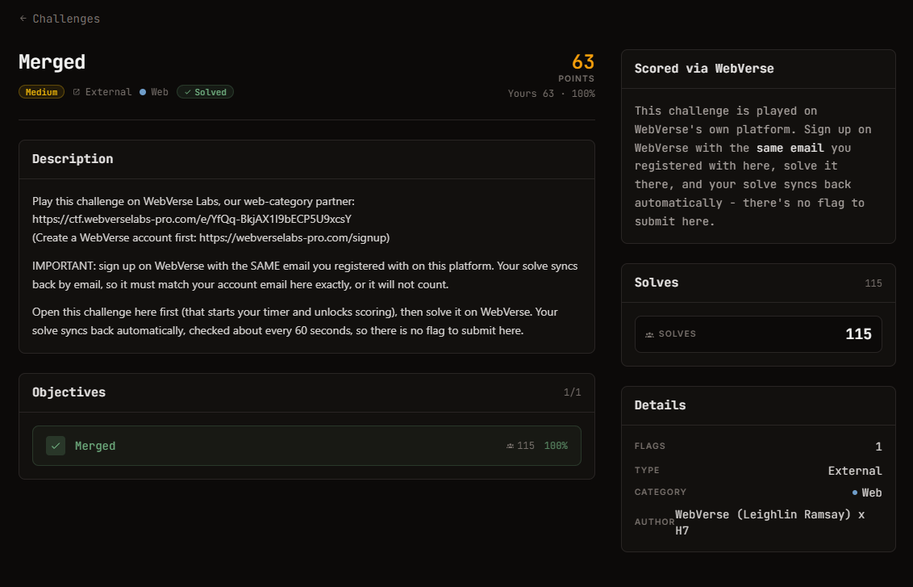

# Merged - Web (Medium)

Ảnh đề bài gốc, chụp từ thẻ challenge:




**Thể loại:** Web (SSTI) · **Độ khó:** medium · **Điểm:** 200 · **Nền tảng:** WebVerse Labs
**Tag WebVerse:** `SSTI` · **Author:** carl_sagan · **Cờ:** `WEBVERSE{...}`
**Instance:** `f3f0bac2-5765-merged-fa7dc.mystery-challenges.webverselabs-pro.com` (đã stop)

## Nguyên văn đề (WebVerse briefing)

```text
Certmarq is a course-certificate platform: design a certificate once, merge in your learners,
and issue verifiable copies when they finish. The template designer renders each certificate on
Certmarq's own servers so issuers can preview exactly how a learner's copy will look before
sending it. It trusts the designer a little more than it should.
```

## Thông tin đã xác minh

| Field | Value |
| --- | --- |
| Đăng ký issuer | `POST /register` (Organisation name / Work email / Password), không cần xác minh email |
| Sink | `POST /designer/preview`, field `body` (HTML + merge field), render bằng `render_template_string` |
| Engine | Jinja2/Flask (`{{7*'7'}}` -> `7777777`, `{{config.items()}}` in ra Flask config) |
| Bộ lọc | chỉ cấm đúng chuỗi `__`; thông báo: *the pattern "__" is not allowed in certificate templates* |
| Rò rỉ phụ | `SECRET_KEY` hiện qua `{{config.items()}}`; `{{session}}` hiện `uid` -> còn có thể giả session |
| RCE | `www-data`, đọc được `/flag.txt`; `entrypoint.sh` tự nhận "unsandboxed Jinja2 SSTI" |

## Approach Summary

Vượt bộ lọc bằng cách **không viết `__` trong template**: tên dunder (`__globals__`) được đưa vào
qua `request.args` ở query string, còn body chỉ chứa `lipsum|attr(request.args.g)`.
Được chuỗi khai thác đầy đủ trong `analysis/payload.md`.

## Reproduce

Xem `analysis/payload.md` (snippet JS đã verify). Bài này **không có `exploit.py`** vì script
`requests` chưa kịp kiểm chứng thì instance đã bị stop - lý do chi tiết ở cuối file đó.

Kết quả đã lấy: `WEBVERSE{8ba2f569dafeedea7f4f6848757e1917}`.
