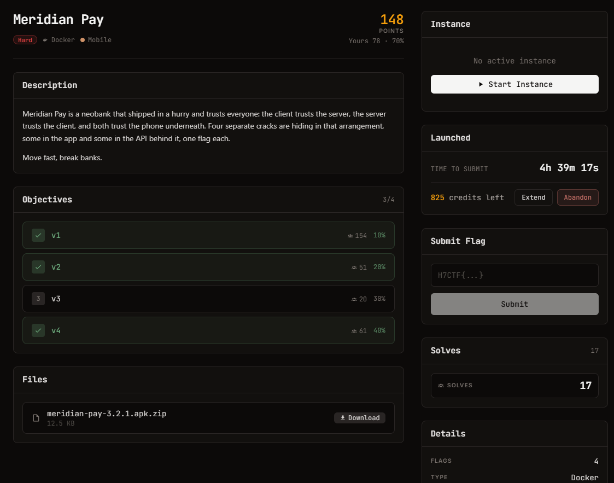

# Meridian Pay — Mobile (Hard)

Ảnh đề bài gốc, chụp từ thẻ challenge:



## Challenge Text

```text
Meridian Pay
hard · Docker · Mobile · 329 điểm

Meridian Pay is a neobank that shipped in a hurry and trusts everyone: the client
trusts the server, the server trusts the client, and both trust the phone underneath.
Four separate cracks are hiding in that arrangement, some in the app and some in the
API behind it, one flag each.

Move fast, break banks.

Objectives
1  v1   51 solves  10%
2  v2   15 solves  20%
3  v3    5 solves  30%
4  v4   16 solves  40%

Files: meridian-pay-3.2.1.apk.zip (12.5 KB)
```

Instance: `https://web-3f25599ac74e8a91.web.h7tex.com`

## Verified Metadata

| Field | Value |
| --- | --- |
| Artifact | `files/meridian-pay-3.2.1.apk` (rút ra từ `meridian-pay-3.2.1.apk.zip` 12771 B) |
| Size | 16885 B |
| SHA-256 | `447c3cd07770cfd78c6601f9076167208e5b670f3708be085cb69d08f741efa1` |
| File Type | ZIP (APK), build D8 backend=dex compilation-mode=debug min-api=24 |
| Nội dung | `AndroidManifest.xml` 4088 B, `classes.dex` 13776 B, `resources.arsc` 1100 B, `res/layout/activity_main.xml`, `META-INF/` |
| Package | `com.meridian.pay` |
| Chuỗi trong `resources.arsc` | account, connect, promo, server, share, status |
| Flag Format | `H7CTF{uuid}`, một cờ cho mỗi objective |
| Cờ trong APK | Không có. Quét toàn bộ `classes.dex` và các tài nguyên không thấy chuỗi `H7CTF{` nào. |

## Approach Summary

Toàn bộ cờ nằm ở API, không nằm trong app. App chỉ là nguồn tài liệu: decompile `classes.dex`
bằng androguard để lấy tên endpoint, tên header và cơ chế xác thực client mà server tin.
Ba trong bốn objective lấy được bằng cách làm đúng những gì app làm, cộng thêm hai chỗ
server tin client quá mức: header tự khai "attested", và `PATCH /api/v1/profile` nhận ghi
`role`. Objective v3 chưa lấy được.

## Reproduce

```bash
python exploit.py https://web-3f25599ac74e8a91.web.h7tex.com
```

Kết quả: v1, v2, v4. v3 không in ra gì.
