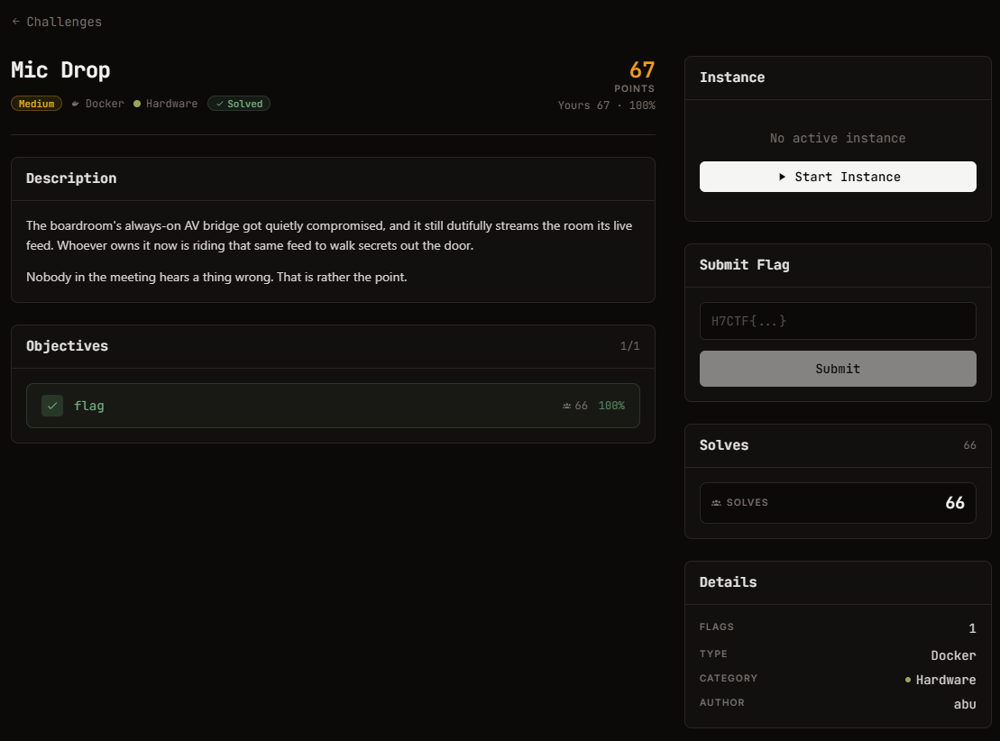

# Mic Drop - Hardware (Medium)

Ảnh đề bài gốc, chụp từ thẻ challenge:



**Thể loại:** Hardware / Network steganography · **Độ khó:** medium · **Điểm:** 211 · **Docker** (live)

## Challenge Text

```text
The boardroom's always-on AV bridge got quietly compromised, and it still dutifully streams
the room its live feed. Whoever owns it now is riding that same feed to walk secrets out the
door.

Nobody in the meeting hears a thing wrong. That is rather the point.
```

## Thông tin đã xác minh

| Field | Value |
| --- | --- |
| Target | `https://web-021fc06a681e8dca.web.h7tex.com` |
| Server | `mediamtx` (MediaMTX, media streamer) |
| Route stream | `/boardroom/index.m3u8` → `main_stream.m3u8` → `<hash>_main_segN.ts` |
| Codec | AAC `mp4a.40.2`, MPEG-TS, segment ~6.9 s, live playlist trượt ~7 segment |
| Audio sau tách | 48 kHz mono PCM; 47.85 s capture = 9 burst |
| Cấu trúc burst | burst ~1.7 s, lặp lại mỗi ~5.68 s; mở đầu mỗi burst là âm thuần 1200 Hz ~160 ms |
| Flag Format | `H7CTF{...}` |

## Approach Summary

Dữ liệu không nằm trong container (TS chỉ có một PID audio, không private stream, không ID3, không stuffing)
mà nằm trong **chính tín hiệu âm thanh**: AFSK chuẩn Bell 202 (mark 1200 Hz / space 2200 Hz) chạy ở
**300 baud**, 8N1, phát lặp lại đều đặn trên live feed. Chỉ cần tải segment, tách PCM, rồi giải điều chế
so sánh năng lượng hai dải 1200/2200 Hz theo từng bit.

## Reproduce

```bash
# khi instance còn chạy
python exploit.py https://web-021fc06a681e8dca.web.h7tex.com/boardroom 60
# instance đã stop -> chạy từ segment đã lưu trong files/
python exploit.py files/352f5b477507_main_seg15.ts
```

Kết quả: `H7CTF{7f0cb1b6-34ee-46c0-945b-1f069dff2a29}` (8/9 burst đọc giống hệt nhau).
