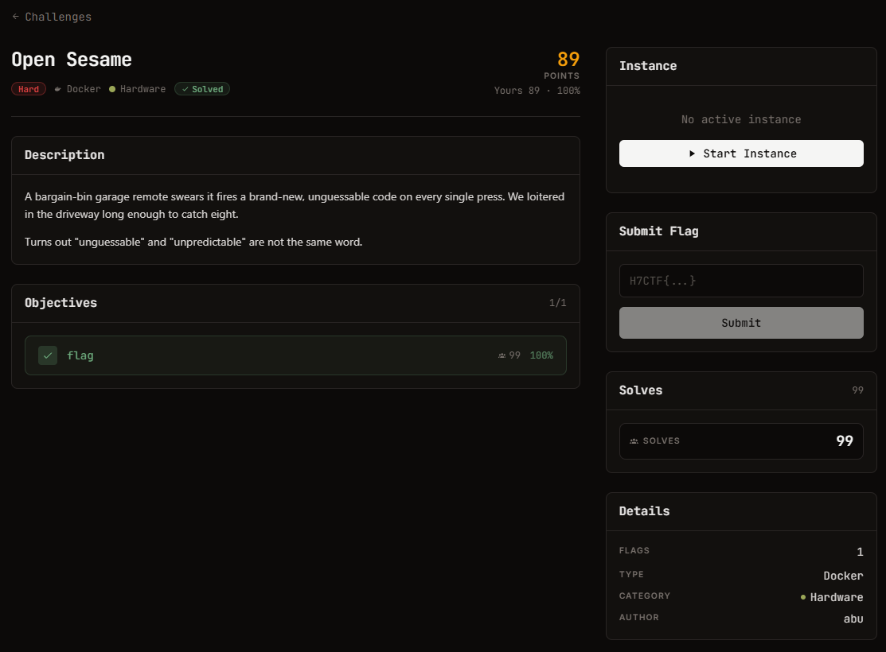

# Open Sesame — Hardware (Hard)

Ảnh đề bài gốc, chụp từ thẻ challenge:



## Đề bài (nguyên văn)

```
Open Sesame
hard
Docker
Hardware
295

Points

Description
A bargain-bin garage remote swears it fires a brand-new, unguessable code on every single press. We loitered in the driveway long enough to catch eight.

Turns out "unguessable" and "unpredictable" are not the same word.

Objectives
0/1
1
flag
19
100%
Instance
Running
Session
Connect

The service can take a few seconds to start after launch. If it does not respond, wait a moment and retry.

HTTP
:443
https://web-7a56034b5423964c.web.h7tex.com

Time left

29m 56s

Extensions

0/ 2
```

Trang chủ còn ghi rõ giao diện nộp:

```
We recorded 8 button presses of a cheap "rolling code" garage remote
(433 MHz, on-off keyed). The capture is raw complex baseband.
file: capture.cf32 (interleaved float32 I/Q, little-endian, fs = 1000000 Hz)

The garage receiver ignores any code it has already seen. Work out what the remote
would transmit on its next press, and send that code:
POST /unlock    body: {"code": "<12 hex digits = the 48-bit frame>"}
```

## Intake

| Field | Value |
| --- | --- |
| Đích | `https://web-7a56034b5423964c.web.h7tex.com` |
| Artifact | `capture.cf32` — 3353600 B = 419200 mẫu I/Q float32 LE, fs 1 MHz (0.419 s) |
| Nộp | `POST /unlock {"code": "<12 hex>"}` |
| Kết quả | `{"status": "unlocked", "flag": "H7CTF{f6091c17-1155-4d06-8a90-b826fd758185}"}` |
