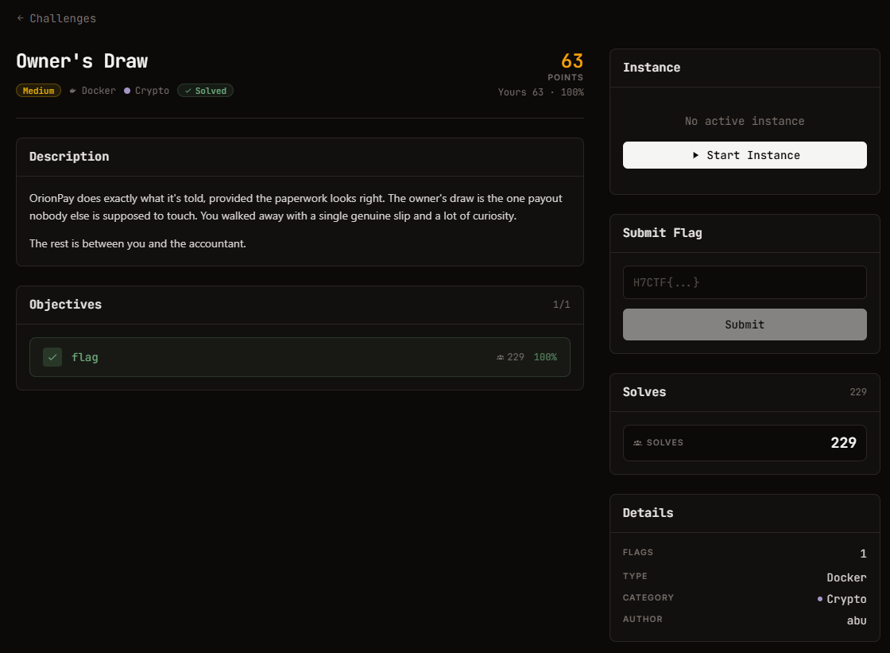

# Owner's Draw - Crypto (medium, 63 điểm)

Ảnh đề bài gốc, chụp từ thẻ challenge:



## Đề (nguyên văn)

> OrionPay does exactly what it's told, provided the paperwork looks right. The owner's draw is the one payout nobody else is supposed to touch. You walked away with a single genuine slip and a lot of curiosity.
>
> The rest is between you and the accountant.

- Category: Crypto, medium, 63 points, Docker
- Instance: `https://web-b39cfff63c4c78b9.web.h7tex.com`
- Objective: 1 flag

## Index page (`Server: BaseHTTP/0.6 Python/3.11.16`)

```json
{"service": "OrionPay webhook receiver",
 "endpoints": {
   "GET /sample": "a captured legitimate webhook (body + signature)",
   "POST /webhook": "process a webhook; body raw, header X-Signature = SHA256(secret||body); role=owner pays out",
   "POST /v2/webhook": "next-gen signing (HMAC-SHA256)"},
 "hint": "an owner-role payout releases the flag"}
```

## Sample (`GET /sample`)

```
body        : event=payment.succeeded&amount=500&currency=usd&customer=cus_9f2a&role=guest   (76 B)
X-Signature : 14d500d5920a994b21e6208be15a8fb73043b724038dcfa29e904531d929f6a7
signing     : X-Signature: SHA256(secret || body)
```

## Hành vi đã đo

| request | kết quả |
| --- | --- |
| `POST /webhook` body thật + sig thật | `200 {"ok": true, "role": "guest", "note": "no owner payout"}` |
| `POST /webhook` body thật + sig sai | `401 {"error": "bad signature"}` |
| `POST /v2/webhook` body thật + sig SHA256 | `401 {"error": "bad signature"}` (v2 dùng HMAC, không nhận MAC cũ) |
| `POST /webhook` body thật + `&role=owner`, sig thật | `401` (verify trước khi parse) |

## Kết quả

```
[+] secret length guess=15   body tail=b'\x00\x00\x02\xd8&role=owner'
[+] /webhook -> 200 {"ok": true, "payout": "authorized", "flag": "H7CTF{786dff67-75cd-4d4e-8b74-55edb1353aad}"}
```

**Cờ:** `H7CTF{786dff67-75cd-4d4e-8b74-55edb1353aad}`
