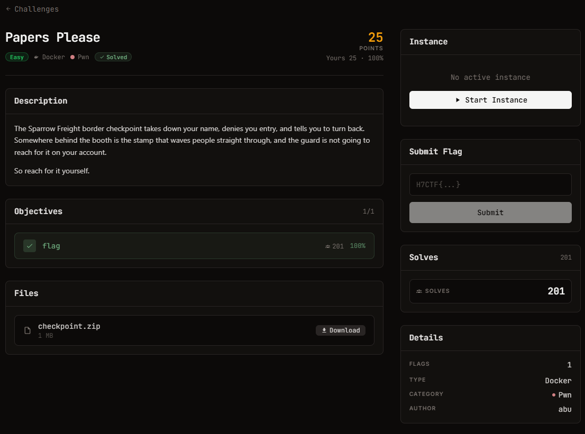

# Papers Please — Pwn (Easy)

Ảnh đề bài gốc, chụp từ thẻ challenge:



## Đề bài (nguyên văn)

```
Papers Please
easy
Docker
Pwn
26

Points

Description
The Sparrow Freight border checkpoint takes down your name, denies you entry, and tells you to turn back. Somewhere behind the booth is the stamp that waves people straight through, and the guard is not going to reach for it on your account.

So reach for it yourself.

Objectives
0/1
1
flag
56
100%
Files
checkpoint.zip

1 MB

Instance
Running
Session
Connect

The service can take a few seconds to start after launch. If it does not respond, wait a moment and retry.

TCP
:42578
nc pwn.h7tex.com 42578

Time left

38m 55s

Extensions

0/ 4
Dạng flag:H7CTF{}
```

## Intake

| Field | Value |
| --- | --- |
| Challenge | Papers Please |
| Category | Pwn (easy) |
| Artefact | `files/checkpoint.zip` — 1077085 B, sha256 `737ceea6141bae312961246233581a00dd3f36789fff2bfce38d396aa209da0b` |
| Bên trong | `checkpoint` (ELF x86-64, 16344 B), `libc.so.6` (2129424 B), `ld-linux-x86-64.so.2` (236616 B), `README.txt` |
| Remote | `pwn.h7tex.com:42578` (TCP) |
| Flag format | `H7CTF{...}` |
| "Solved" nghĩa là | In được flag từ `/flag` trên instance đang chạy |

`README.txt` nói rõ target: **Ubuntu 24.04, glibc 2.39 (2.39-0ubuntu8.9), x86-64**, và libc đi kèm chính là libc mà đích chạy.
