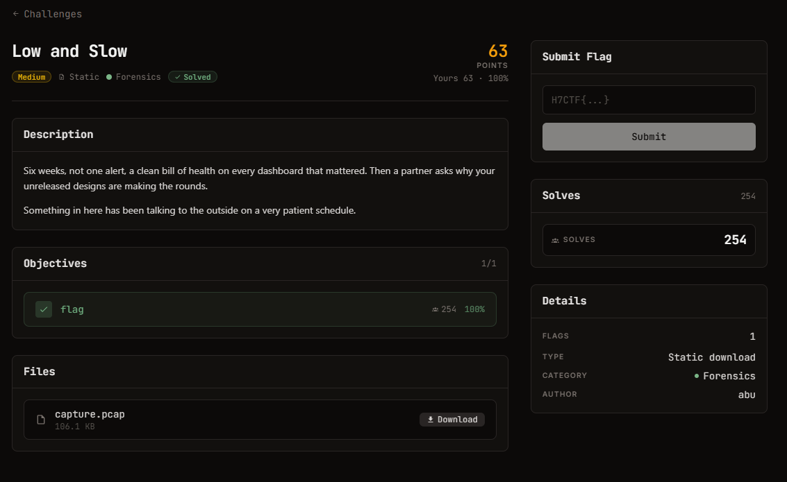

# Patient Exfil — Forensics (Medium)

Ảnh đề bài gốc, chụp từ thẻ challenge (thẻ "Low and Slow", Forensics):



## Nguyên văn đề (thẻ "Low and Slow", Forensics, Medium)

> Six weeks, not one alert, a clean bill of health on every dashboard that mattered. Then a
> partner asks why your unreleased designs are making the rounds.
>
> Something in here has been talking to the outside on a very patient schedule.

| Field | Value |
| --- | --- |
| Tên trên thẻ | Low and Slow |
| Thể loại | Forensics (Static download) |
| Độ khó | Medium |
| Điểm | 63 (Yours 63 - 100%) |
| Tác giả | abu |
| Lượt giải | 254 |
| Objective | `flag` (1/1, 254, 100%) |
| File | `capture.pcap` (166.1 KB) |

## Thông tin đã xác minh được từ file

| Field | Value |
| --- | --- |
| Artifact | `files/capture.pcap` (bản sao từ `Downloads/capture (2).pcap`) |
| Size | 108.604 byte |
| SHA-256 | `3ab17689659f80efadceea1adc2eea5e9bddfcc3254ad85e89c4c75ee20bbb76` |
| Độ dài phiên | 1260 gói / 148,31 giây, toàn bộ là loopback `127.0.0.1` |
| Giao thức | 1080 gói TCP (8080, 8443), 180 gói DNS/UDP, không có ICMP |
| Objective | Đọc được "thông điệp bí mật" mà máy trong lab gửi ra ngoài theo nhịp chậm |
| Flag Format | `H7CTF{...}` |

## Approach Summary

DNS tunneling: 3 qname thuộc `*.sync.cdn-telemetry-lab.net`, mỗi label = chỉ mục 2 chữ số + payload base32. Ghép theo chỉ mục rồi decode. Chi tiết trong `writeup.md`, các bước loại trừ trong `notes.md`.

## Reproduce

```bash
python exploit.py files/capture.pcap
```

Kết quả: `H7CTF{6787b86cc777f426b9c0}` (đã lưu trong `flag.txt`).
