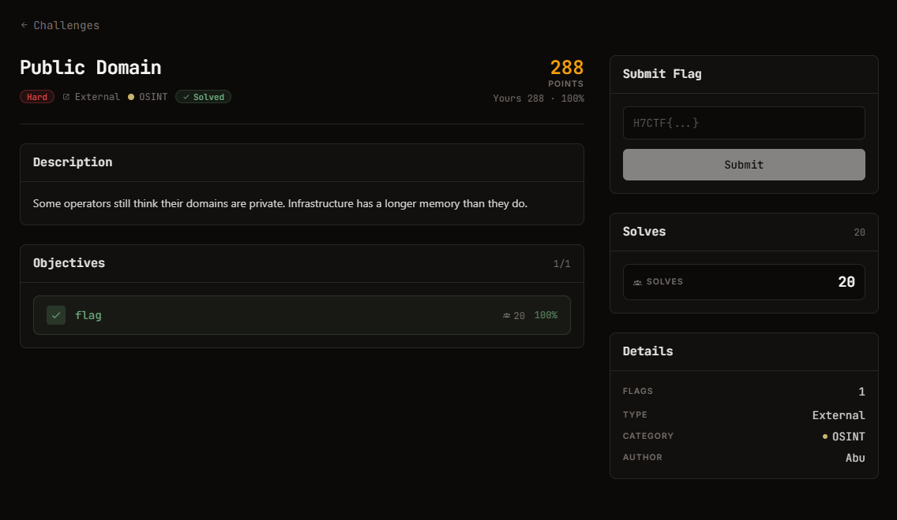

# Public Domain — OSINT (Hard)

## Đề bài (nguyên văn từ thẻ challenge)

> Some operators still think their domains are private. Infrastructure has a longer memory than
> they do.

| Field | Value |
| --- | --- |
| Thể loại | OSINT |
| Độ khó | Hard |
| Điểm | 288 |
| Tác giả | Abu |
| Lượt giải | 20 |
| File | không có (TYPE: External) |

Ảnh đề bài gốc, chụp từ thẻ challenge:

## Ghi chú

Bài OSINT thuần, không có artifact kèm theo. Đồng đội nhận, mình dừng sau bước thu thập repo.
Xem `HANDOVER.md`.
