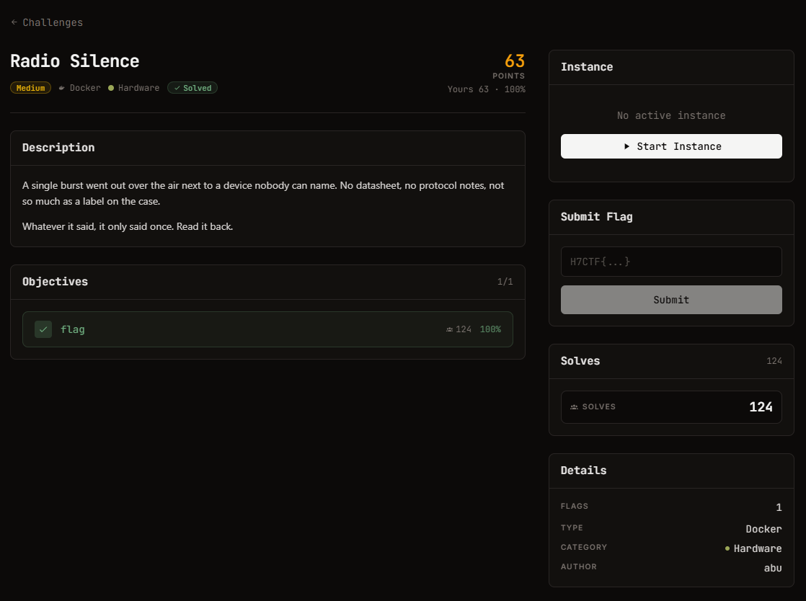

# Radio Silence — Hardware (Medium)

Ảnh đề bài gốc, chụp từ thẻ challenge:



## Đề (nguyên văn)

> A single burst went out over the air next to a device nobody can name. No datasheet, no protocol notes, not so much as a label on the case.
>
> Whatever it said, it only said once. Read it back.

- Category: Hardware, medium, 115 points, Docker
- Instance: `https://web-0350e37b217a0cbc.web.h7tex.com` (HTTP :443)
- Objective: 1 flag. "Recover the message."

## Index page (nguyên văn, đã lưu `analysis/index.html`)

```
$ curl -sS https://web-0350e37b217a0cbc.web.h7tex.com
<!doctype html><meta charset=utf-8><title>field capture</title>
<h1>unknown transmission :: field capture</h1>
<p>One burst, pulled off the air near a device we could not identify. No datasheet,
no protocol notes. Whatever it says is in here.</p>
<ul>
<li>file: <a href="capture.cf32">capture.cf32</a> (complex baseband, interleaved
float32 I/Q, little-endian: I0 Q0 I1 Q1 ...)</li>
<li>sample rate: 1000000 Hz</li>
</ul>
<p>Recover the message.</p>
```

Headers: `Server: SimpleHTTP/0.6 Python/3.11.16`, `Content-Length: 450`. Không có endpoint nộp bài, chỉ có file duy nhất.

## Artifact

```
capture.cf32   393544 B   sha256 167a70fa10c344c85ad6bc95…
               = 49193 mẫu I/Q (mỗi mẫu 8 B) @ 1 Msps = 49.193 ms
```

## Metadata tín hiệu đã xác minh

| thuộc tính | giá trị | cách đo |
| --- | --- | --- |
| envelope | không đổi trong burst, chỉ có 2 vùng im lặng ở đầu/cuối | `abs(iq)`, run-length |
| burst | mẫu 2909 … 46109 = **43200 mẫu = 43.2 ms** | |
| điều chế | **2-FSK**, không phải OOK | `abs()` phẳng, phổ có đúng 2 đỉnh |
| 2 tone | **+35.0 kHz và +85.0 kHz** (tâm 60 kHz, độ lệch ±25 kHz) | FFT cửa sổ Hanning trên burst, độ phân giải 23.1 Hz, đỉnh nằm chính xác giữa bin |
| symbol rate | **10 kBaud** (100 mẫu/symbol) | cụm transition của discriminators theo mod-100, line phổ 10001.9 Hz |
| số symbol | **432 = 54 byte chẵn** | 43200/100 |
| frame | `aa aa aa aa aa aa` sync + `2d d4 2b` header + message + `7a 65` trailer | decode |

Kết quả decode: `\xaa\xaa\xaa\xaa\xaa\xaa-\xd4+H7CTF{6780856d-db42-4cfa-8b56-c62109d8417c}ze`
