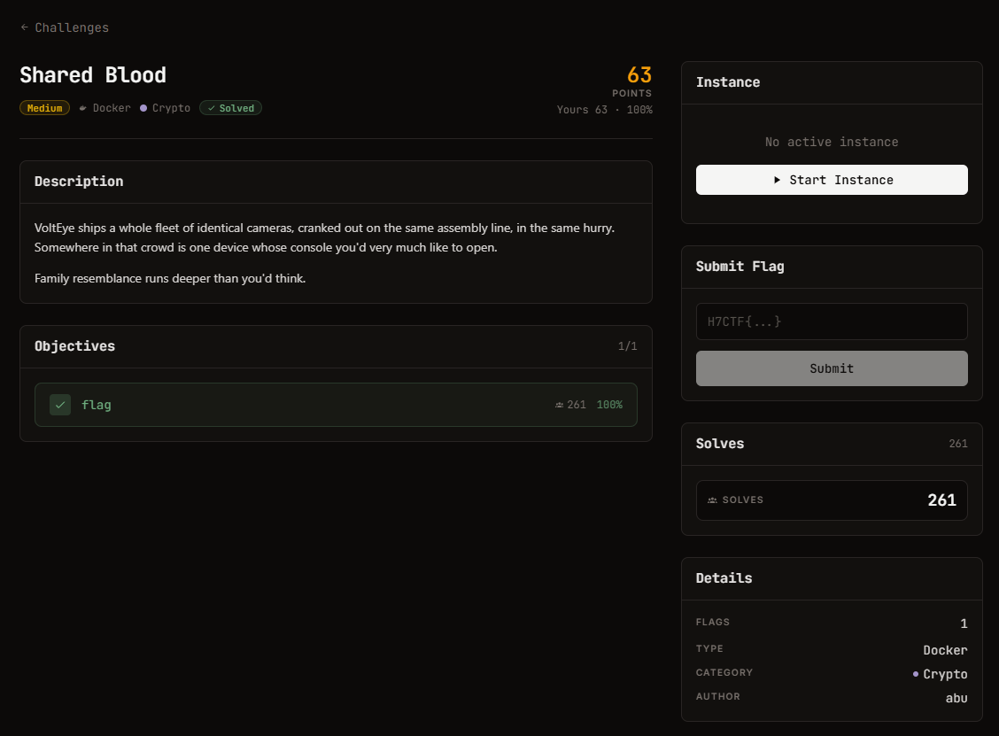

# Shared Blood - Crypto (medium, 63 điểm)

Ảnh đề bài gốc, chụp từ thẻ challenge:



## Đề (nguyên văn)

> VoltEye ships a whole fleet of identical cameras, cranked out on the same assembly line, in the same hurry. Somewhere in that crowd is one device whose console you'd very much like to open.
>
> Family resemblance runs deeper than you'd think.

- Category: Crypto, medium, 63 points, Docker
- Instance: `https://web-bd09e5c5af420bbc.web.h7tex.com`
- Objective: 1 flag

## Index page

```html
<h2>VoltEye Camera Cloud</h2>
<p>Device fleet console. Admin bootstrap required.</p>
API: GET /fleet (device certs) . GET /captured (one intercepted provisioning payload)
     POST /admin {"token":"..."}
<form ...> <input id=t placeholder="admin bootstrap token"> <button>unlock</button>
```

`Server: BaseHTTP/0.6 Python/3.11.16`.

## Data lấy từ service

```
GET /fleet     -> {"e": 65537, "devices": [ {serial, n}, ... ]}    30 thiết bị
                   độ dài modulus: 1023 hoặc 1024 bit
GET /captured  -> {"note": "intercepted provisioning payload (RSA/PKCS1v1.5,
                   encrypted to the device cert)",
                   "serial": "VE-C1E90650", "e": 65537,
                   "ciphertext": "02da5a4c...140568"}              256 hex = 128 byte
```

Mục tiêu là device `VE-C1E90650`; muốn vào console cần đúng một thứ: **admin bootstrap token**, và token đó là plaintext của ciphertext đã chặn.

## Kết quả

| bước | giá trị |
| --- | --- |
| cặp modulus xung đột prime | `VE-C1E90650` ~ `VE-23795497` (duy nhất 1 cặp trong C(30,2)=435 cặp) |
| `gcd` | số nguyên tố 512 bit |
| phân tích | `p = 512 bit`, `q = n/p = 512 bit`, `p*q == n` |
| token sau khi bỏ phiếu PKCS#1 v1.5 | `vlt_482528c8142ca9b1fe57cfe3` |
| `POST /admin` | `{"authed": true, "flag": "H7CTF{a727587f-67d5-4246-b7c3-e57798659fac}"}` |

**Cờ:** `H7CTF{a727587f-67d5-4246-b7c3-e57798659fac}`
