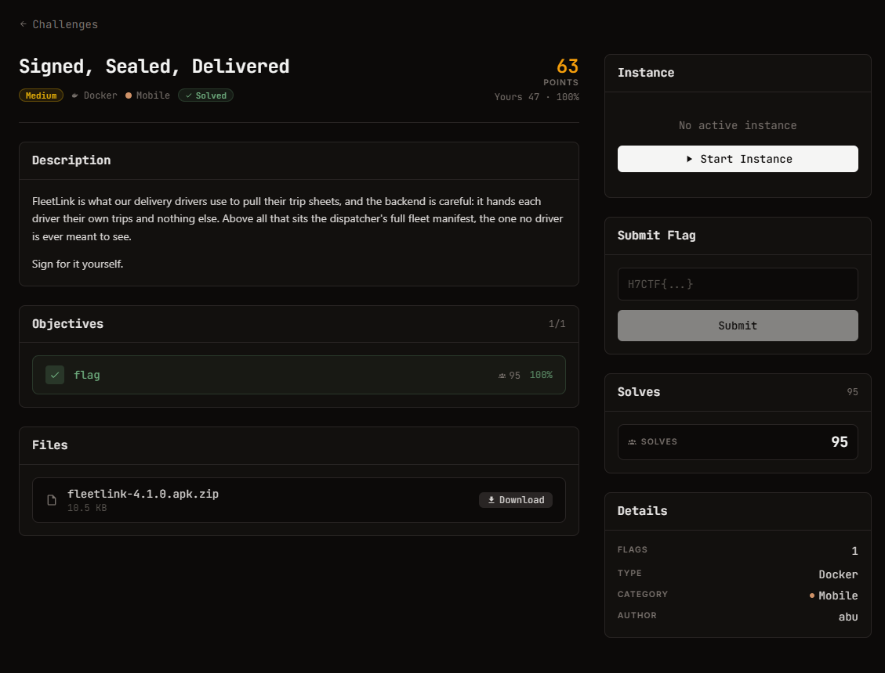

# Signed, Sealed, Delivered — Mobile (Medium)

## Đề bài (nguyên văn từ thẻ challenge)

> FleetLink is what our delivery drivers use to pull their trip sheets, and the backend is
> careful: it hands each driver their own trips and nothing else. Above all that sits the
> dispatcher's full fleet manifest, the one no driver is ever meant to see.
>
> Sign for it yourself.

| Field | Value |
| --- | --- |
| Thể loại | Mobile |
| Độ khó | Medium |
| Điểm | 63 (bài tính 100%) |
| Tác giả | abu |
| Lượt giải | 95 |
| File | `fleetlink-4.1.0.apk.zip` (10.5 KB) |
| Objective | `flag` (1/1) |

Ảnh đề bài gốc, chụp từ thẻ challenge:

## Ghi chú

Folder `../fleetlink/` là cùng một bài (FleetLink là tên app trong APK), giữ lại vì bên đó có
script phân tích DEX riêng. Bản HANDOVER của bài này nằm ở `HANDOVER.md`: cơ chế là request
signing HMAC-SHA256 với pepper hardcode trong DEX, không phải JWT.
