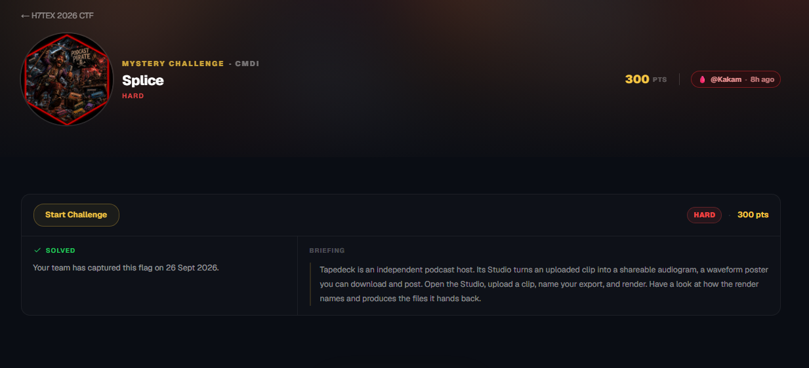
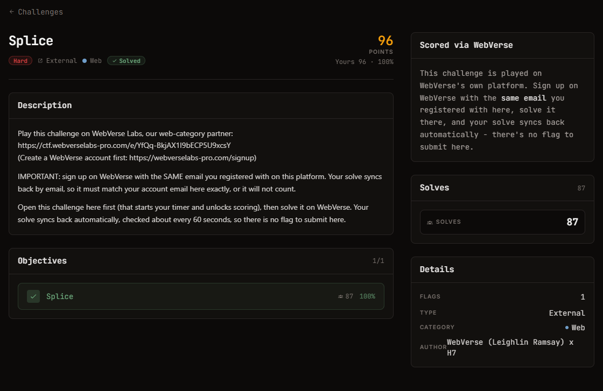

# Splice — Web (hard), Static, 420 pts

Ảnh đề bài gốc, chụp từ thẻ challenge:




## Đề bài (nguyên văn)

```
Splice
hard
Static
Web
420

Points

Description
Play this challenge on WebVerse Labs, our web-category partner:
https://ctf.webverselabs-pro.com/e/YfQq-BkjAX1I9bECP5U9xcsY
(Create a WebVerse account first: https://webverselabs-pro.com/signup)

IMPORTANT: sign up on WebVerse with the SAME email you registered with on this platform. Your solve syncs back by email, so it must match your account email here exactly, or it will not count.

Open this challenge here first (that starts your timer and unlocks scoring), then solve it on WebVerse. Your solve syncs back automatically, checked about every 60 seconds, so there is no flag to submit here.

Objectives
0/1
1
Splice
6
100%
Launched
Time to submit
10h 58m 45s
2575 credits left
Extend
Abandon
Scored via WebVerse
This challenge is played on WebVerse's own platform. Sign up on WebVerse with the same email you registered with here, solve it there, and your solve syncs back automatically - there's no flag to submit here.
```

## Intake

| Mục | Giá trị |
| --- | --- |
| Challenge | Splice |
| Category | Web, tag `Static`, độ khó hard, 420 points |
| Đích được cung cấp | `https://ctf.webverselabs-pro.com/e/YfQq-BkjAX1I9bECP5U9xcsY` |
| Trang signup | `https://webverselabs-pro.com/signup` |
| File | chưa có (đề không kèm bundle) |
| Flag | không nộp ở platform chính; solve sync ngược bằng email, kiểm tra ~60s một lần |
| Ràng buộc | email WebVerse phải trùng khớp email đã đăng ký platform chính |
| Hết hạn nộp | 10h58m tính từ lúc paste đề (≈ 2026-09-26 23:1x) |

## Trạng thái

- `GET /e/YfQq-BkjAX1I9bECP5U9xcsY` **không kèm cookie** → HTTP 200 nhưng là SPA rỗng, client render "Sign in to join a team and play this event." cùng link `/login?next=...`.
- Platform: Next.js (App Router, RSC payload), đứng sau Cloudflare, CSP cho `connect-src` gọi `api.webverselabs-pro.com` và Stripe (`frame-src https://*.stripe.com`). Đăng nhập bằng Google hoặc email.
- → **Chặn ở bước xác thực.** Không có nội dung challenge, không có artifact, nên chưa có gì để phân tích. Việc sign up / sign in dùng tài khoản cá nhân do người dùng tự thực hiện.

## Ghi chú an toàn

Platform bên thứ ba có thu phí (credits + Stripe) và yêu cầu dùng lại email đã đăng ký ở nơi khác. Khuyến nghị: mật khẩu riêng biệt, không tái sử dụng mật khẩu của platform chính.
