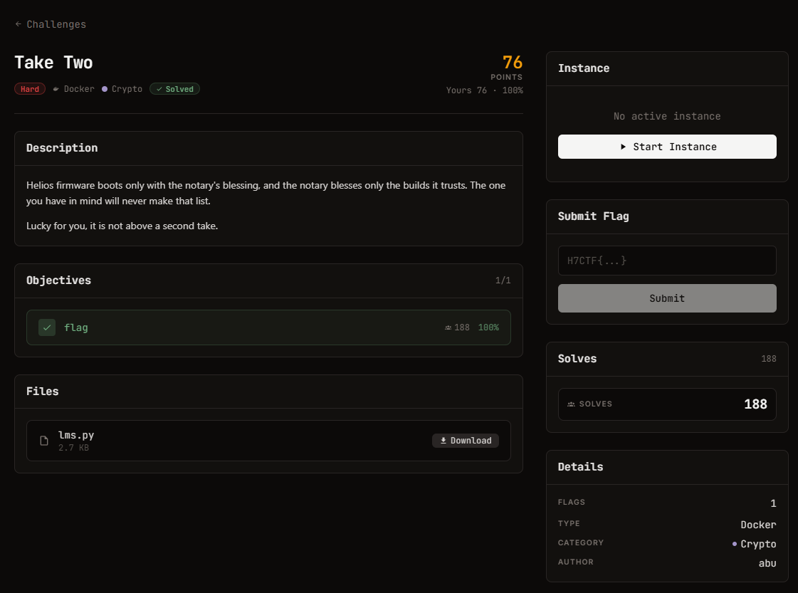

# Take Two - Crypto (Hard)

Ảnh đề bài gốc, chụp từ thẻ challenge:



**Thể loại:** Crypto / stateful signatures · **Độ khó:** hard · **Điểm:** 106 · **Docker** (live)
**Target:** `https://web-18955a87eb148fa7.web.h7tex.com` · **Cờ:** `H7CTF{...}`

## Challenge Text

```text
Helios firmware boots only with the notary's blessing, and the notary blesses only the
builds it trusts. The one you have in mind will never make that list.

Lucky for you, it is not above a second take.
```

## File cho trước

`files/lms.py` (2.744 B, sha256 `366e683f602a1776...`): WOTS+ chữ ký one-time ghép thành lá của
cây Merkle chiều cao 4 (16 lá), theo tinh thần RFC 8554 nhưng hashing tự nhất quán.
Đầu file tự ghi chú: *"the vulnerability is operational (a leaf reused via a counter reset),
not in this code"*.

Thông số: `N=32`, `W=16` (digit 4 bit), `LEN1=64`, `LEN2=3` (checksum), `LEN=67`, `TREE_H=4`.

## API đã xác minh

| Endpoint | Hành vi |
| --- | --- |
| `GET /root` | `4fdc04c24a2f43e650e2c20ffe0d789d218f0a6f63156d2f3693c3076cd34687` |
| `POST /sign {firmware}` | trả `{firmware, sig:{leaf, wots[67], path[4]}}`; từ chối build chứa `BACKDOOR` |
| `POST /rollback` | "maintenance: revert the signing counter" -> **đặt lại counter về 0** |
| `POST /deploy {firmware, sig}` | boot nếu `verify(msg, sig, root)` đúng; trả cờ khi thành công |

Chữ ký đầu tiên rơi vào leaf 1 (leaf 0 đã bị tiêu hao trước đó), và sau một lần rollback thì
mọi chữ ký tiếp theo đều dùng **leaf 0**.

## Approach Summary

`sig[i] = chain(sk_i, d_i)` với `d_i` là digit 4 bit của `sha256(msg)` kèm checksum, và `chain`
chỉ đi được một chiều (hash tới trước). Hai message khác nhau trên cùng một lá cho ta, ở mỗi toạ độ,
giá trị chuỗi tại chữ số nhỏ nhất đã gặp. Thu đủ chữ ký thì mọi toạ độ đều chạm chữ số 0 hoặc 1,
tức ta giữ "gốc" của chuỗi và với mở rộng tới trước được tới **bất kỳ** chữ số nào -> ký được message
mà notary từ chối ký.

## Reproduce

```bash
python exploit.py https://<host>
```
