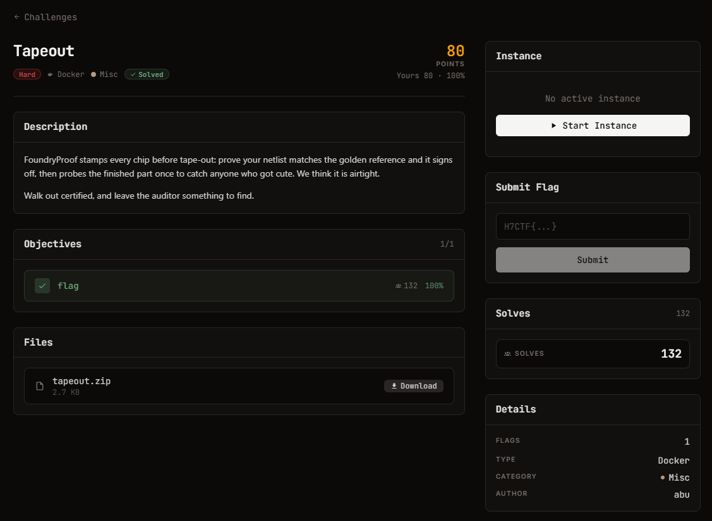

# Tapeout — Misc (Hard)

Ảnh đề bài gốc, chụp từ thẻ challenge:



**Thể loại:** Misc / formal verification abuse · **Độ khó:** hard · **Điểm:** 158 · **Docker** (live)
**Target:** `nc pwn.h7tex.com 40634` · **Cờ:** `H7CTF{...}`

## Challenge Text

```text
FoundryProof stamps every chip before tape-out: prove your netlist matches the golden
reference and it signs off, then probes the finished part once to catch anyone who got cute.
We think it is airtight.

Walk out certified, and leave the auditor something to find.
```

## File cho trước (`files/`, từ `tapeout.zip`)

| File | Vai trò |
| --- | --- |
| `hdl.py` | parser + simulator + **bộ sinh công thức z3** cho Tiny-HDL (not/and/or/xor/add/shl/shr/eq/mux, single-assignment) |
| `verifier.py` | đúng cái certifier FoundryProof chạy: `certify(reference, yours)` |
| `reference.hdl` | thiết kế vàng: `y = ((a ^ 0x9E3779B9) + (a >> 16)) ^ 0x1337C0DE` |
| `SPEC.md` | luật thắng: `audit vector A_AUDIT = 0xDEADBEEF`, `sabotage value MAGIC = 0xB105F00D` |

## Chốt của đề (đọc `verifier.py` kỹ)

```python
SAMPLE_BITS = 16
sample = z3.BitVec("sample", SAMPLE_BITS)
a = z3.ZeroExt(WIDTH - SAMPLE_BITS, sample)      # <-- 16 bit cao luôn bằng 0
solver.add(build(ref, a) != build(sub, a))
return solver.check() == z3.unsat
```

Certifier chỉ chứng minh hai thiết kế giống nhau trên tập input **`a < 2^16`**.
Nó không lượng hoá toàn bộ 32 bit. Mà audit lại chạy ở `0xDEADBEEF` - nằm ngoài miền được chứng minh.
Câu "probes the finished part **once**" chính là chỗ đó: một điểm kiểm tra duy nhất, và điểm đó
không thuộc miền chứng minh.

## Approach Summary

Netlist đệ trình tính đúng transform của reference rồi dùng `eq (shr a 16) 0` làm mask bit,
`mux` giữa kết quả reference và hằng `MAGIC`:

- `a < 2^16` -> mask = `0xFFFFFFFF` -> output == reference -> **CERTIFIED**
- `a >= 2^16` (gồm `0xDEADBEEF`) -> mask = `0` -> output == `0xB105F00D` -> **sabotage**

## Reproduce

```bash
python exploit.py pwn.h7tex.com 40634
```

Script tự kiểm mô hình trước khi nộp (khớp reference trên toàn miền sampled, khác ở ngoài miền đó).

Kết quả đã lấy: `H7CTF{afd4beac-e86e-409b-907d-b519bb748599}` (xem `flag.txt`).

> Ghi chú trung thực: lần chạy **duy nhất** có kết quả là lúc instance còn sống, server trả
> `CERTIFIED` + `sign-off compromised` + cờ. Ngay sau đó service ngừng phản hồi (0 byte),
> nên các lần chạy lại chỉ đến được bước self-check cục bộ.
