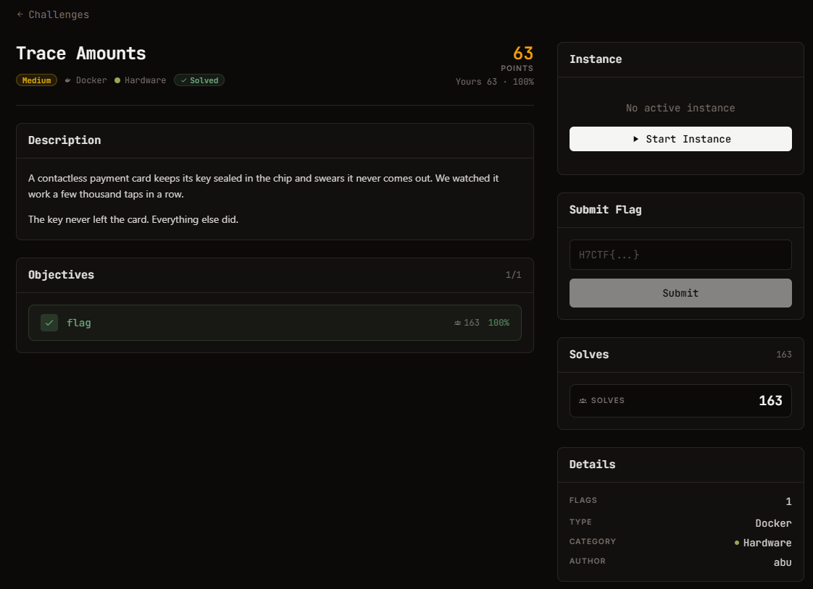

# Trace Amounts - Hardware (Medium)

Ảnh đề bài gốc, chụp từ thẻ challenge:



**Thể loại:** Hardware / Side-channel · **Độ khó:** medium · **Điểm:** 125 · **Docker** (live)

## Challenge Text

```text
A contactless payment card keeps its key sealed in the chip and swears it never comes out.
We watched it work a few thousand taps in a row.

The key never left the card. Everything else did.
```

Trang challenge mô tả thêm:

```text
A contactless payment card runs AES-128 to authorize each tap. We sat a current probe on its
power line and captured 500 authorizations, logging the power trace and the (known) challenge
plaintext for each. The card never reveals its key. It does not have to.

- traces.npy      : float32 array, 500 x 700 (one power trace per authorization)
- plaintexts.npy  : uint8 array, 500 x 16 (the plaintext for each trace)
- secret.enc      : a secret the card encrypted with its AES-128 key (ECB)

Recover the key and decrypt the secret.
```

## Verified Metadata

| Field | Value |
| --- | --- |
| `files/traces.npy` | float32, shape (500, 700), 1.400.128 B |
| `files/plaintexts.npy` | uint8, shape (500, 16) |
| `files/secret.enc` | 48 B = 3 block, AES-128-ECB |
| Server | `SimpleHTTP/0.6 Python/3.11.16`, HTTPS self-signed |
| Cấu trúc trace | căn chỉnh hoàn hảo (0 offset cho cả 500 trace); 16 đỉnh hoạt động cách đều 40 sample tại `30 + 40*i` |
| Flag Format | `H7CTF{...}` |

## Approach Summary

Correlation Power Analysis trên vòng đầu của AES-128: với mỗi byte plaintext `i` và mỗi khoá thử `k`,
dựng mô hình rò rỉ `HW(S-box[pt_i ^ k])` rồi tính hệ số tương quan Pearson với từng sample của 500 trace.
Byte nào có peak tương quan vượt hẳn nền noise thì `k` chính là khoá của byte đó.
Slot thời gian `30 + 40*i` cho biết chip xử lý tuần tự từng byte, nhờ vậy biết chỗ nào cần nhìn.

## Reproduce

```bash
python exploit.py files/traces.npy files/plaintexts.npy files/secret.enc
```

Kết quả: key `f937e70cf8f9f6f287a14b0da829ba47`, cờ `H7CTF{48333086-d56b-41f5-b24b-a1d53fb122ec}`.
