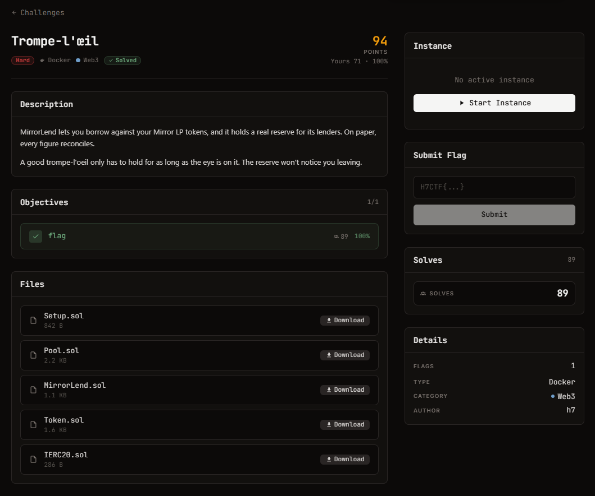

# Trompe-l'œil — Web3 (Hard)

Ảnh đề bài gốc, chụp từ thẻ challenge:



## Challenge Text

```text
Trompe-l'œil - hard - Web3 - 236 điểm

MirrorLend lets you borrow against your Mirror LP tokens, and it holds a real reserve for
its lenders. On paper, every figure reconciles.

A good trompe-l'oeil only has to hold for as long as the eye is on it. The reserve won't
notice you leaving.

Objectives: totalDebt > totalCollateralLP * virtualPrice  (isSolved)
Files: Setup.sol Pool.sol MirrorLend.sol Token.sol IERC20.sol
Instance: https://web-1a41803b1badce11.web.h7tex.com
```

## Thông tin đã xác minh

| Field | Value |
| --- | --- |
| Artifact | `files/*.sol` (5 contract, Solidity 0.8.24) |
| Instance | `GET /` trên chính URL bài trả về plaintext: rpc endpoint (POST cùng URL), chain id 31337, private key của player, địa chỉ Setup |
| Setup | `0x152F449c1aCBf34E2337e33f10Cc3e0B8DCfb14c` (instance đã hết hạn) |
| Objective | làm cho `Setup.isSolved()` trả `true` |
| Flag Format | `H7CTF{uuid}`, lấy bằng `GET /flag` sau khi solve |

Trạng thái ban đầu (đọc on-chain, xem `analysis/state.mjs`): Pool giữ 10 ETH + 10 mUSD,
`totalSupply = 20`, `get_virtual_price() = 1e18`; MirrorLend giữ 1000 mUSD reserve; player
có 100 mUSD và nhiều ETH.

## Approach Summary

`Pool.removeLiquidity` burn LP và gửi ETH **trước** khi chuyển phần token, còn
`MirrorLend.borrow` gọi `pool.get_virtual_price()` trực tiếp. Tái nạp LP bằng token thuần
để pool lệch về phía token (10 ETH / 110 token), rồi `removeLiquidity` từ một contract:
trong callback ETH, giá ảo bị thổi lên 1.6548e18 và lệnh borrow diễn ra theo giá đó; khi
callback kết thúc giá về 1e18 nhưng nợ vẫn còn.

## Reproduce

```bash
npm i ethers@6 solc@0.8.24
node exploit.mjs
```

Kết quả: `H7CTF{0bba5486-eebc-4ee8-a3de-a55e80c787f1}` (đã lưu trong `flag.txt`).
