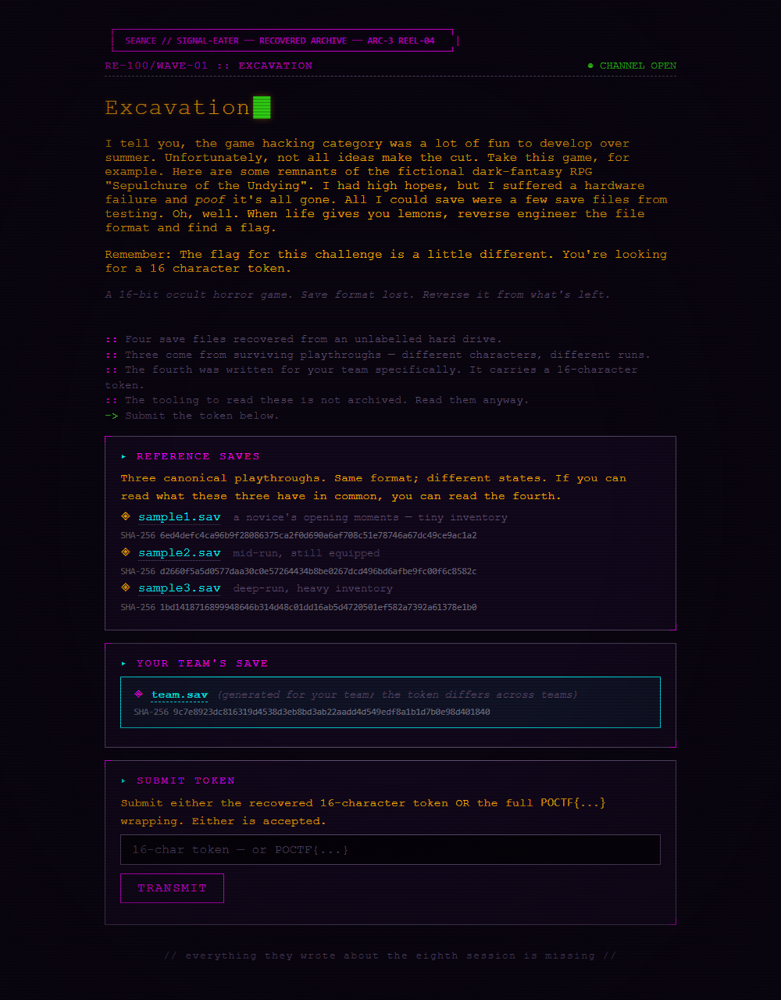

# Excavation (RE-100 / WAVE-01)



*Ảnh thẻ đề chụp từ trang challenge của team ngày 2026-09-29 (HTML lưu ở `analysis/card.html`).*

Trang: <https://pointeroverflowctf.com/challenges/excavation/>
Event: Pointer Overflow CTF 2026, nhánh "SEANCE // SIGNAL-EATER", ARC-3 REEL-04.
Team: 612. Điểm: 100. Trạng thái: đã nộp và được chấp nhận.

## Đề bài (nguyên văn từ trang của team mình)

> I tell you, the game hacking category was a lot of fun to develop over summer. Unfortunately, not all ideas make the cut. Take this game, for example. Here are some remnants of the fictional dark-fantasy RPG "Sepulchure of the Undying". I had high hopes, but I suffered a hardware failure and poof it's all gone. All I could save were a few save files from testing. Oh, well. When life gives you lemons, reverse engineer the file format and find a flag.
>
> Remember: The flag for this challenge is a little different. You're looking for a 16 character token.

> A 16-bit occult horror game. Save format lost. Reverse it from what's left.
>
> :: Four save files recovered from an unlabelled hard drive.
> :: Three come from surviving playthroughs - different characters, different runs.
> :: The fourth was written for your team specifically. It carries a 16-character token.
> :: The tooling to read these is not archived. Read them anyway.
> -> Submit the token below.

REFERENCE SAVES

> Three canonical playthroughs. Same format; different states. If you can read what these three have in common, you can read the fourth.

| file | mô tả | sha256 | kích thước |
|---|---|---|---|
| sample1.sav | a novice's opening moments - tiny inventory | `6ed4defc4ca96b9f28086375ca2f0d690a6af708c51e78746a67dc49ce9ac1a2` | 466 |
| sample2.sav | mid-run, still equipped | `d2660f5a5d0577daa30c0e57264434b8be0267dcd496bd6afbe9fc00f6c8582c` | 857 |
| sample3.sav | deep-run, heavy inventory | `1bd1418716899948646b314d48c01dd16ab5d4720501ef582a7392a61378e1b0` | 1144 |
| team.sav | generated for your team; the token differs across teams | `9c7e8923dc816319d4538d3eb8bd3ab22aadd4d549edf8a1b1d7b0e98d401840` | 1382 |

Bốn file đã tải từ trang challenge và đối chiếu sha256 với card, khớp cả 4.

## Endpoint nộp

Form trên trang không phải `<form>` mà là JS thuần:

```html
<input type="text" id="flag-input" placeholder="16-char token - or POCTF{...}">
<button onclick="submitFlag()">TRANSMIT</button>
```

```js
POST /challenges/excavation/submit
Content-Type: application/json
{"flag": "<token>"}

-> {"correct":true|false,"message":"Correct."|...}
```

Đáp án đúng chỉ trả `"Correct."`, endpoint **không trả về xâu `POCTF{...}`** nào cả.
Thử nộp dạng bọc `POCTF{2VE5EKXUA5IV2R57}` thì server trả `Incorrect. Keep working.`,
tức dạng được chấp nhận là token trần 16 ký tự.

## Đặc điểm quan sát được trên file

- 12 byte đầu giống hệt nhau ở cả 4 file: `9e e1 c7 21 | 02 00 | 02 00 | <u32>`,
  trong đó u32 little-endian đúng bằng kích thước file (466, 857, 1144, 1382).
- Phần thân tự tương quan mạnh ở lag 8, 16, 24, 32 -> key XOR lặp 8 byte, mỗi file một key.
- Bốn dòng cuối của mỗi file kết thúc bằng 14 byte không in được, trong đó luôn có
  `ff ff ff` ở cùng vị trí tính từ cuối.
