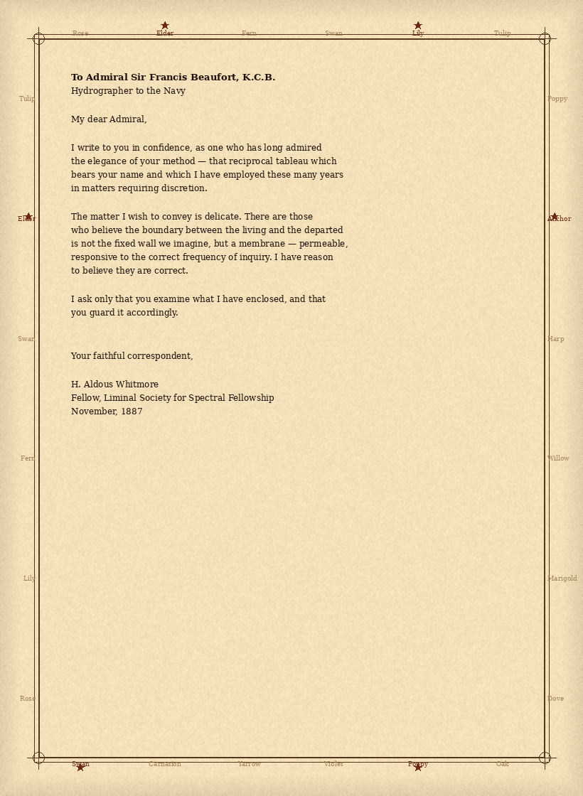

# Đề bài - Letters Never Sent

Ảnh đề bài gốc (thẻ challenge + artifact):



## Nguyên văn đề

```text
Letters Never Sent
Category: Cryptography - Wave: 1 - Points: 95 - Solves: 248

Here we have a letter that was recovered from the estate of Dr. H. Aldous Whitmore.
It was never posted.

Along with the letter, a strange message was discovered. We have no doubt that Dr.
Whitmore meant to keep it secret, given his... Association with occult societies that
was discovered after his death. Despite this, the relationship to the letter remains
unclear, but a connection cannot be discounted.

Find the key the letter hides, and read what Whitmore could not bring himself to send.
```

Ciphertext trên thẻ:

```text
PXYWN{2.612.QNTOXCK6E7DKGMKC.WK4KK6MPPPRJGOFZZI66EISSED}
```

## Thông tin đã xác minh được

| Mục | Giá trị |
| --- | --- |
| Artifact | `files/letter.png` (bản sao từ ảnh thẻ đề) |
| Kích thước | 1.150.873 byte |
| SHA-256 | `907275df295c975e8d6c67bdfa4fd1f6b0461ca6b13b2bba7c3dfd4c775a9980` |
| Định dạng | PNG 820x1120, 8-bit RGB, không interlace |
| Chunk PNG | IHDR + 282 IDAT + IEND, không có tEXt/zTXt, không có byte sau IEND |
| LSB | ratio bit 0 thấp: R 0.4933 / G 0.5036 / B 0.4921, `stegano.lsb` không tìm thấy gì |
| Prefix cờ | `POCTF{...}` (theo trang nộp) |
| Flag per-team | Có. Đề ghi rõ mỗi team một flag khác nhau |

## Nội dung thư (chép nguyên văn từ ảnh)

Người nhận: Admiral Sir Francis Beaufort, K.C.B., Hydrographer to the Navy.
Người gửi: H. Aldous Whitmore, Fellow, Liminal Society for Spectral Fellowship, November 1887.
Đoạn then chốt: "the elegance of your method - that reciprocal tableau which bears your
name and which I have employed these many years in matters requiring discretion."

## Khung viền và các nhãn có dấu sao

6 nhãn trên khung có ngôi sao đỏ, đo bằng pixel (không đọc bằng mắt):

| Cạnh | Vị trí nhãn có sao | Nhãn |
| --- | --- | --- |
| Top (trái sang phải) | 2, 5 | Elder, Lily |
| Right (trên xuống dưới) | 2 | Anchor |
| Bottom (phải sang trái khi đi theo chiều kim đồng hồ) | 5, 1 | Poppy, Swan |
| Left (dưới lên trên) | 2 | Elder |

Đọc theo chiều kim đồng hồ từ góc trên-trái, chữ cái đầu của 6 nhãn: **E L A P S E**.

## Hướng giải đã xác minh được một phần

Beaufort (bảng tra tự nghịch đảo, đúng như thư gợi ý). Với alphabet 26 chữ,
`p = (k - c) mod 26`, năm chữ đầu của ciphertext `PXYWN` + key `ELAPS` cho ra đúng
`POCTF`. Đây là bằng chứng key bắt đầu bằng ELAPS (xác suất ngẫu nhiên 1/26^5).

Thân ciphertext KHÔNG ra tiếng Anh với bất kỳ key Beaufort tuần hoàn nào có prefix
ELAPS (đã quét exhaust key độ dài 5-9 và hill-climb 6-16). Chi tiết giả thuyết và
bằng chứng loại trừ trong `notes.md`.

## Chạy lại

```bash
python exploit.py            # in ra các ứng viên cờ từ key ELAPSE
```
