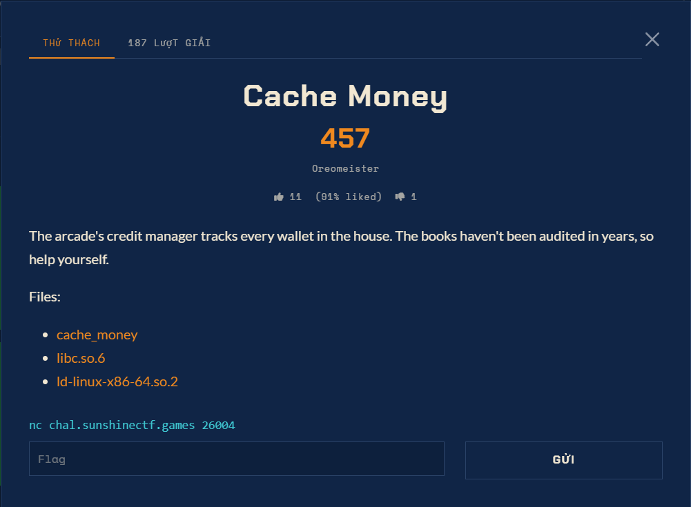

# Cache Money — Pwn (Hard)

Ảnh đề bài gốc, chụp từ thẻ challenge:



## Đề bài (nguyên văn)

> The arcade's credit manager tracks every wallet in the house. The books haven't been
> audited in years, so help yourself.

Remote: `nc chal.sunshinectf.games 26004`
Flag format: `sun{...}`
Objectives: 1 flag, 39 solves.

## Metadata đã kiểm chứng

| file | size | sha256 (16) | ghi chú |
|---|---|---|---|
| `files/cache_money` | 14592 B | `f6b0c44221ac029f` | ELF 64-bit, ET_EXEC (no PIE), NX, Partial RELRO, động |
| `files/libc.so.6` | 2125328 B | `c1e50a701d3245c8` | Ubuntu glibc **2.39-0ubuntu8.3** |
| `files/ld-linux-x86-64.so.2` | 236616 B | | không cần chạy local |

Nhập biên (dynsym): `free malloc calloc puts write read fgets strtol strcspn exit setvbuf __memset_chk __printf_chk __stack_chk_fail`.
Không có `system` / `execve` trong PLT, nên bắt buộc phải tính địa chỉ `system` từ libc.

## Chế độ đã xác minh

- `setvbuf(stdout, NULL, 2, 0)` với `2 == _IONBF` -> stdout **không buffer**, mọi prompt hiện ngay.
- stdin **không** được setvbuf -> full buffer, `fgets` và `read(0,...)` trộn nhau nên client phải gửi từng dòng và đợi sát theo marker.
- Server accept nhiều lệnh trên một kết nối, không có timeout ngắn, nhưng client chờ kiểu "sleep 1s mỗi prompt" bị cắt kết nối.

## Lệnh chạy lại

```bash
python exploit.py --host chal.sunshinectf.games --port 26004 \
  --cmd "echo START; cat /ctf/flag.txt; echo END"
```

Kết quả: `flag.txt` = `sun{s4fe_l1nk1ng_w0nt_s4ve_y0ur_tc4che}`
