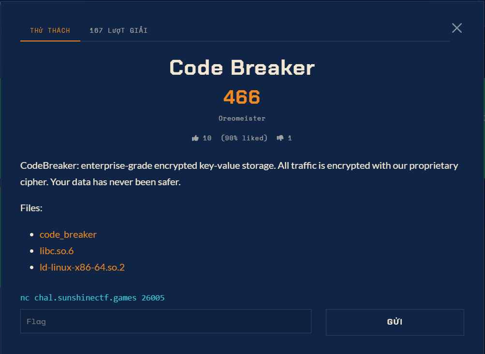

# Code Breaker — Crypto/Pwn (Hard)

Ảnh đề bài gốc, chụp từ thẻ challenge:



## Đề bài (từ ảnh chụp)

```
Code Breaker
499
Oreomeister
5 (100% liked) 0

CodeBreaker: enterprise-grade encrypted key-value storage. All traffic is encrypted
with our proprietary cipher. Your data has never been safer.

Files:
  code_breaker
  libc.so.6
  ld-linux-x86-64.so.2

nc chal.sunshinectf.games 26005
```

Cờ dạng `sun{...}`.

## Intake

| Field | Value |
| --- | --- |
| Đích | `chal.sunshinectf.games:26005` |
| Binary | `code_breaker` 14640 B, sha256 `ed7201eba1a5a771...`, ELF **ET_DYN (PIE)**, stripped, NX, canary |
| libc | `libc.so.6` 2125328 B, `ld-linux-x86-64.so.2` 236616 B |
| Kết quả | `sun{cr4ck_tHe_ciPh3r_fr33_thE_heaP}` |

Mitigation đáng chú ý: `readelf -l` cho GNU_RELRO **kết thúc tại 0x4000**, còn `.got.plt` chạy 0x403fe8..0x404068 → các JUMP_SLOT ở `0x404000..0x404060` nằm ngoài vùng read-only, tức **GOT vẫn ghi được**.
