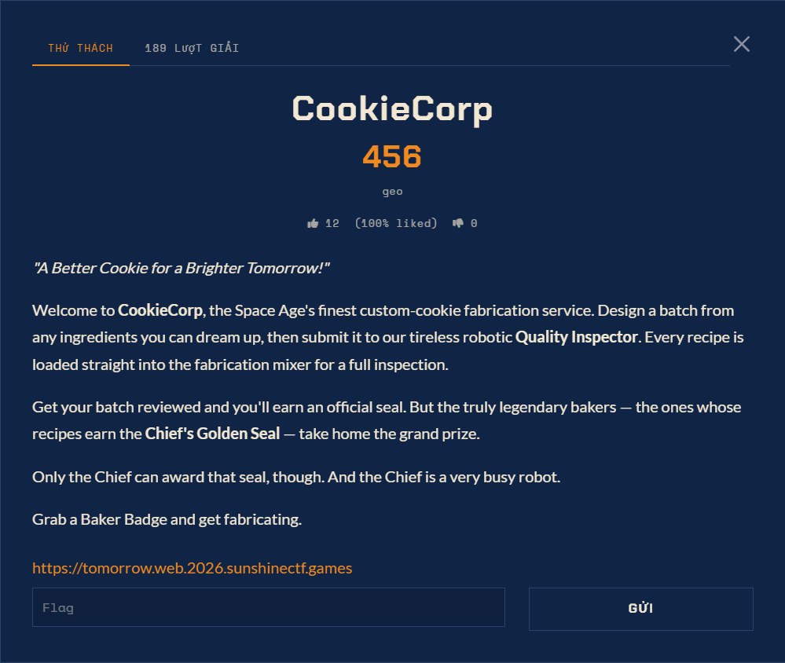

# CookieCorp — Web (Medium)

Ảnh đề bài gốc, chụp từ thẻ challenge:



## Nguyen van de (the challenge)

```
CookieCorp
489
geo
```

```
"A Better Cookie for a Brighter Tomorrow!"

Welcome to CookieCorp, the Space Age's finest custom-cookie fabrication service.

Design a batch from any ingredients you can dream up, then submit it to our tireless
robotic Quality Inspector. Every recipe is loaded straight into the fabrication mixer
for a full inspection. Get your batch reviewed and you'll earn an official seal. But
the truly legendary bakers - the ones whose recipes earn the Chief's Golden Seal -
take home the grand prize. Only the Chief can award that seal, though. And the Chief
is a very busy robot.

Grab a Baker Badge and get fabricating.
```

```
https://tomorrow.web.2026.sunshinectf.games
```

Rating: 7 (100% liked), ~7 solves. Instance URL nam trong card, khong can Launch.

## Dinh huong

Web + bot. Player dang ky `baker`, tao "batch" (title + toi da 300 ingredient
`name=value`), submit, mot worker dang nhap staff mo `/review/<id>` va chay
`/static/js/mixer.js`. Mixer viet moi ingredient thanh cookie trong jar cua visitor
roi POST `/api/seal`. Seal tra ve `reviewed` (hien thi "standard") hoac `chief`
(Golden Seal, render `<div class="seal gold">...<div class="flag">` - day la kenh
duyet nhat cua cờ).

## Trang thai

**CHUA CO CỜ.** Chan ngan da do duoc: `/api/seal` bloc baker truoc khi doc batch
(gate la role trong DB, khong phai cookie), XSS chet, mass-assignment chet o moi sink,
NoSQL chet, khong co route an, khong co source leak. Primitive duy nhat con song:
tran header cua request "stamp" cua inspector (`>=143` ingredient toi da = 16.4 KB,
`--max-http-header-size` 16 KB cua Node) -> batch dung o trang thai
`reviewed` + Seal trong. Ba gia thuyet time-based dang duoc theo doi
(`ladder_watch.py`, `legend_seed.py`, `inject_jam.py`). Chi tiet do luong: `notes.md`.
