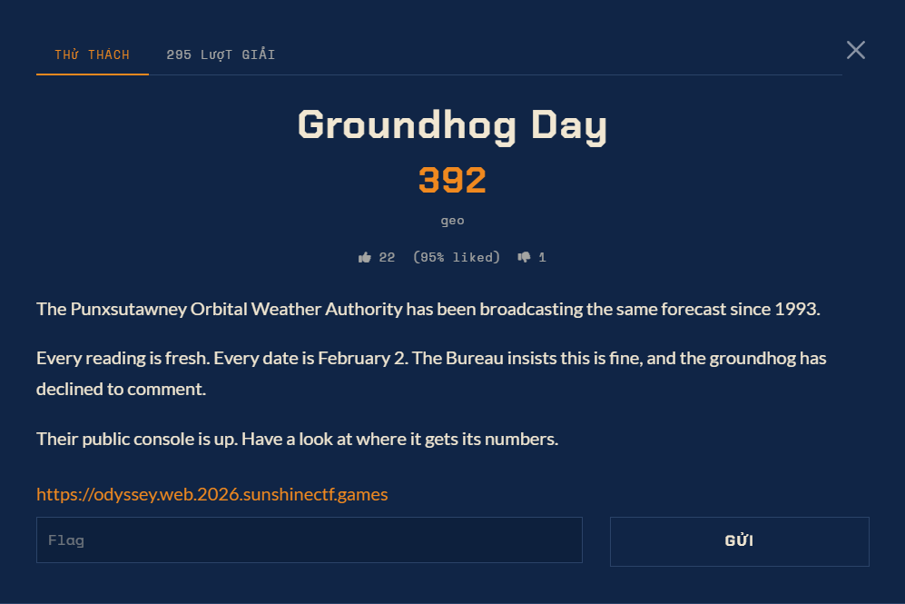

# Groundhog Day — Web (Hard)

Ảnh đề bài gốc, chụp từ thẻ challenge:



## Challenge Text

```text
Groundhog Day
497
geo

The Punxsutawney Orbital Weather Authority has been broadcasting the same forecast
since 1993.

Every reading is fresh. Every date is February 2. The Bureau insists this is fine,
and the groundhog has declined to comment.

Their public console is up. Have a look at where it gets its numbers.
```

Instance: `https://odyssey.web.2026.sunshinectf.games` (URL nằm ngay trên card, không cần Launch).
Rating: 4 (100% thích). Instance URL nằm trực tiếp trên card, không cần Launch.

## Verified Metadata

| Field | Value |
| --- | --- |
| Artifact | không có file kèm; chỉ có instance web |
| Endpoint public | `/` (GET và POST) và `/static/styles.css`; cả hai method đều nhận `feed=<url>` |
| Lỗi | SSRF: server fetch URL trong `feed`, chỉ nhận scheme do allow-list cho phép, echo body về `<pre class="tape">` (escape HTML), thân response không bị ép là JSON |
| Oracle | `<!-- feed-debug: source=<url> bytes=<n> -->` cho biết độ dài body, dùng được cả khi page không render gì |
| Chặn | CRLF bị từ chối (`bytes=0`); không forward header của người gọi; không có passthrough tham số |
| Egress | không có ra ngoài, kể cả http lẫn https (kiểm chứng bằng một host công khai tự dựng, chính nó đọc được 200) |
| Dịch vụ nội bộ | console `127.0.0.1:5000` (duy nhất route `/`) và station `127.0.0.1:8000` |
| Station | `GET /feed` (JSON ngẫu nhiên, 13 khoá cố định), `GET /health` (`ok\n`), `POST /report` |
| `/report` | render PDF từ `content` bằng wkhtmltopdf 0.12.5 (dòng NOTE trong index nội bộ), trả JSON có `data` base64; GET thì 405 |
| Mock GCP | `169.254.169.254:80` listing `/` và `/computeMetadata/` đọc được; `v1/*` trả 403 "Missing Metadata-Flavor:Google header" |
| Flag Format | `sun{...}` |

## Approach Summary

`feed=<url>` là một SSRF có kênh đọc. Client bên trong là libcurl, nên `gopher://` lọt qua
allow-list và biến một GET của console thành một request HTTP thô tùy ý: đủ để POST `/report`
và đủ để thêm header vào request metadata. `/report` render bằng wkhtmltopdf 0.12.5, bản cho
phép JavaScript và local file access; `document.title` từ XHR `file://` hiện ra trong `/Title`
của PDF, thành kênh đọc plaintext. Cờ ở `/flag.txt`.

## Status

**Đã giải** ngày 2026-09-27. Cờ: `sun{s1x_m0r3_w33ks_0f_g0ph3r_ssrf}`, đọc từ `/flag.txt`
của container. Chi tiết và bằng chứng từng bước: `writeup.md`, `notes.md`.

## Artifact đã lưu

- `files/root.html` - toàn bộ trang chủ, gồm comment `ops:` về `feed=<url>` và form bị comment.
- `files/station_index.txt` - 1045 byte index của station (docs ba endpoint + NOTE wkhtmltopdf).
- `files/first_post_report_response.txt` - phản hồi đầu tiên của `/report` qua gopher.
- `files/sanity.pdf`, `files/xhr_hostname.pdf`, `files/lfi__etc_passwd.pdf` - PDF render thật.
- `files/styles.css`, `files/meta_403.html`, `files/canary_reply.html`.
- `analysis/ssrf.py` - harness gọi SSRF, trích `bytes=` và tape.

## Reproduce

```bash
python exploit.py                # đọc /flag.txt, /flag, /ctf/flag.txt theo thứ tự
python exploit.py /etc/passwd    # đọc tuỳ ý file
```
