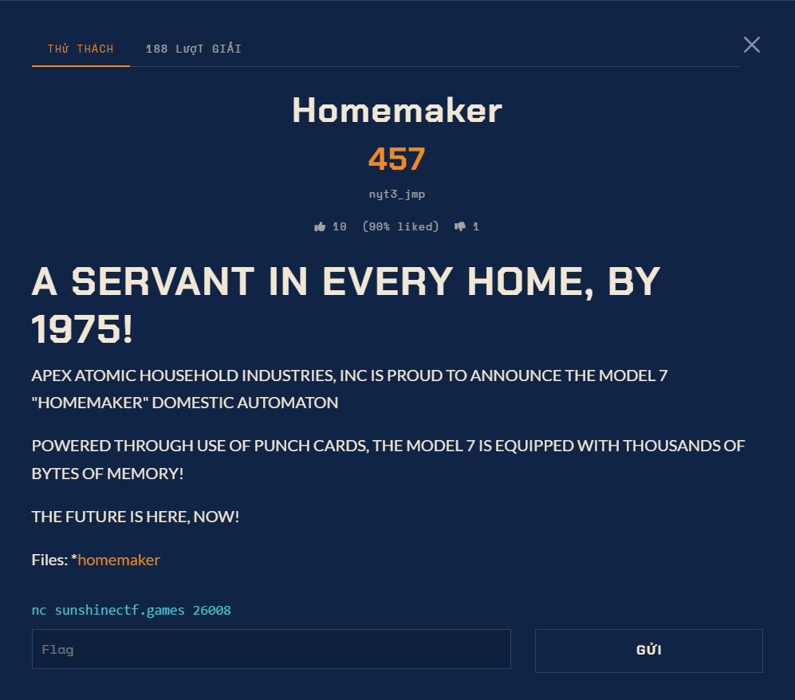

# Homemaker — Pwn (Hard)

Ảnh đề bài gốc, chụp từ thẻ challenge:



## Description

> A SERVANT IN EVERY HOME, BY 1975!
> POWERED THROUGH USE OF PUNCH CARDS, THE MODEL 7 HOMEMAKER WILL FREE YOU FROM THE BURDEN
> OF DOMESTIC LABOUR FOREVER!

Chi tiết:

| Field | Value |
| --- | --- |
| Service | `nc sunshinectf.games 26008` |
| File duy nhất | `files/homemaker` (ELF 64-bit, PIE, shared) |
| Điểm | 498 |
| Hint / libc kèm theo | **không có** |

Người chơi chỉ nhận được đúng một binary và một cổng TCP. Không có libc, không có
`ld.so`, không có Dockerfile, không có hint.

## Trạng thái binary

```
ELF 64-bit LSB pie executable, x86-64, dynamically linked
NX  : enabled        CANARY : enabled
PIE : shared         RELRO  : FULL (.rela.ro phủ 0x3d78-0x4000)
Import: write, read, system, memcpy, setvbuf, __stack_chk_fail,
        __libc_start_main, __cxa_finalize
```

Toàn bộ binary (14472 byte) **không chứa một lệnh `syscall` nào** (quét `0f 05` và `cd 80`
trên cả file, 0 kết quả). Đây là điểm khoá của bài: muốn gọi syscall thô phải tự đi tìm
lấy một địa chỉ `syscall` trong libc của server, mà libc thì không được cung cấp.

## Giao thức

```
frame = ESC '[' <len:u16 BE> <payload[len]> <crc8(payload)> ESC '\'
crc8  : acc = 0; với mỗi byte b: acc ^= b, rồi 8 lần
        acc = (acc & 0x80) ? ((acc<<1) ^ 0x2f) : (acc<<1)      (hàm tại 0x11e9)
```

`payload[0]` là mã lệnh, bảng nhảy tại `0x21c8`, bộ phân phối tại `0x1865`:

| lệnh | ý nghĩa |
| --- | --- |
| 0 | trả status `0xe7` |
| 1 | **thẻ khoá dịch vụ**: `01 <u32 BE>`; key hardcode `0x1337c35f` (so sánh tại `0x12a7`). OK -> `capacity = 0x100`, `auth = 1` |
| 2 | **đấm thẻ**: `02 <bytes>` -> chép vào `mem` (256 byte trên stack của dispatcher, tại `rbp-0x110`) |
| 3 | **in bộ nhớ**: `emit(0, mem, capacity)` |
| 4 | ack |
| 5 | `system("/bin/echo -n ''")` + ack |

Trạng thái lỗi: `0xe1` sai header, `0xe2` sai độ dài, `0xe3` sai checksum, `0xe4` sai đuôi,
`0xe5` chưa xác thực, `0xe6` chưa có thẻ nào.
