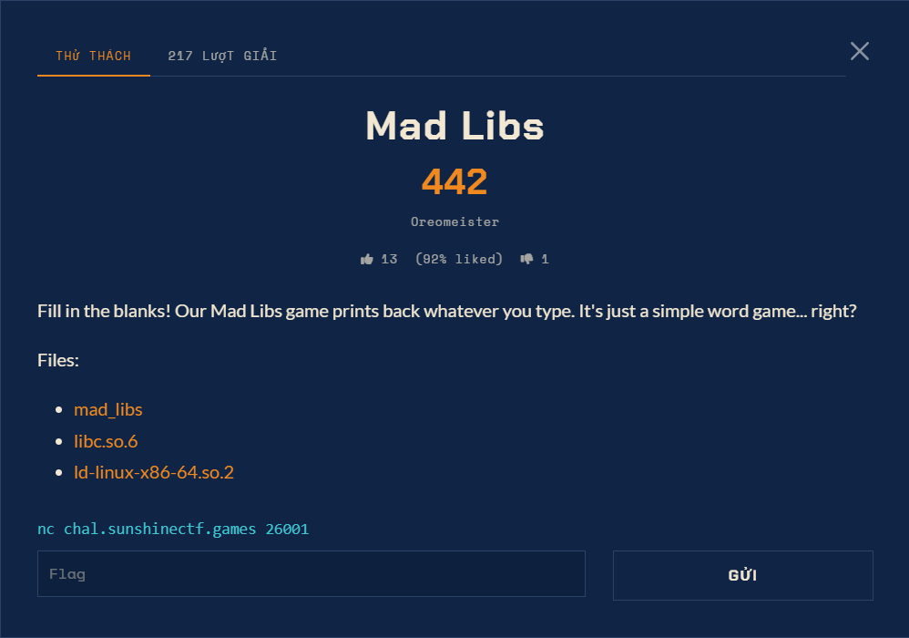

# Mad Libs - Pwn (Medium)

Ảnh đề bài gốc, chụp từ thẻ challenge:



- Sự kiện: SunshineCTF (qua nền tảng H7TEX)
- Điểm: 499, solves: 38
- Tác giả: Oreomeister
- Đề nguyên văn: `Fill in the blanks! Our Mad Libs game prints back whatever you type. It's just a simple word game... right?`
- Target: `nc chal.sunshinectf.games 26001`
- Flag Format: `sun{...}` (suy ra từ bài suntrail cùng nền tảng, và được xác nhận bởi chính cờ thu được)

## Artifact đã xác minh

| file | size | sha256 |
|---|---|---|
| `files/mad_libs` | 14584 | `f65aca17be585e86c0cba30a629bdccfc9cc65129e850e26b916872065a2f1a1` |
| `files/libc.so.6` | 2125328 | `c1e50a701d3245c8c45a1ba40151efe414ac41d2c9ae604087b4875e0d85c4fb` |
| `files/ld-linux-x86-64.so.2` | 236616 | `854a9eb45875e00f48e1e89d40251317931d2d82555ab612d6090beba0c9f972` |

`file`: ELF 64-bit LSB PIE, dynamically linked, stripped.
Mitigation: PIE=yes, RELRO=**partial** (không có BIND_NOW), NX=yes, Canary=yes.
libc: **Ubuntu glibc 2.39-0ubuntu8.3**.

## Cấu trúc chương trình

`main` tại `0x11c9`, buffer tại `[rbp-0x110]`:

```c
puts("=== Mad Libs ===");
puts("Fill in the blanks!");
for (i = 0; i <= 7; i++) {
    printf("(%d) > ", i + 1);
    if (fgets(buf, 0x100, stdin) == NULL) break;
    printf(buf);                      // <= format string
}
puts("Story complete!");
```

Không có overflow: buffer rộng `0x110` byte trong khi `fgets` chỉ đọc `0x100`, nên không với tới
saved rbp hay return address. Toàn bộ khai thác đi qua đúng một primitive: `printf(buf)`.

GOT (partial RELRO, ghi được), từ `.rela.plt`:

```
0x4000 puts   0x4008 __stack_chk_fail   0x4010 printf   0x4018 fgets   0x4020 setvbuf
```

## Offset đã dùng

```
binary : main = 0x11c9   printf@GOT = 0x4010
libc   : printf = 0x600f0   system = 0x58740   "/bin/sh" = 0x1cb42f
```

## Lệnh chạy lại

```bash
python exploit.py                      # in cờ và ghi vào flag.txt
python exploit.py "cat /ctf/flag.txt"  # chạy lệnh tùy ý sau khi có shell
python analysis/selftest_fmt.py        # tự kiểm bộ dựng %hhn, 500/500
```

## Kết quả

```
sun{f1ll_iN_th3_g0T_eNtry}
```

Đã chạy lại `exploit.py` hai lần liên tiếp, cả hai lần đều lấy được đúng chuỗi trên.
