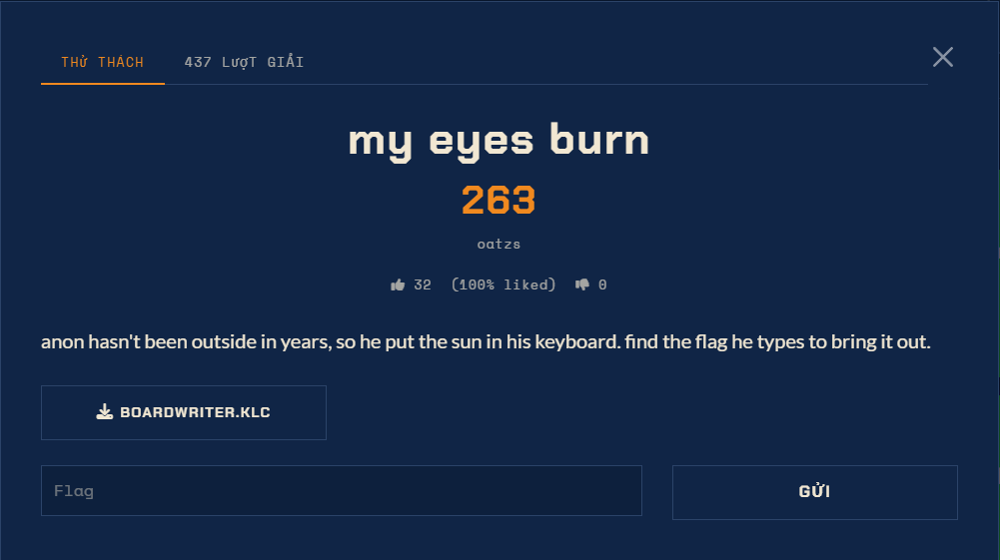

# My Eyes Burn - Misc (Medium)

Ảnh đề bài gốc, chụp từ thẻ challenge:



## Đề (nguyên văn)

> anon hasn't been outside in years, so he put the sun in his keyboard. find the flag he types to bring it out.

File: `BOARDWRITER.KLC` (bản local: `C:\Users\Administrator\Downloads\boardwriter.klc`,
3562 B, UTF-16LE + CRLF, đã copy vào `files/`).

## Định dạng

`.klc` là nguồn layout bàn phím Windows (MSKLC). Hai quy tắc dùng ở đây:

- Trong bảng `KEYS`, một ký tự có hậu tố `@` nghĩa là phím đó là **dead key**.
  File này có đúng một: `29 OEM_3 0 0060@ 007e -1` -> phím backtick `` ` `` là dead key.
- Trong khối `DEADKEY <state>`, dòng `<src> <res>@` nghĩa là: đang ở trạng thái dead key
  `<state>` mà gõ `<src>` thì chuyển sang trạng thái chết mới `<res>`; **không có `@`** thì
  `<res>` được in ra thật và chuỗi kết thúc.

## Cấu trúc suy ra được

```
17 khối DEADKEY, 1 dead key vật lý, 1 điểm vào duy nhất (0060), 1 điểm kết thúc duy nhất
terminal: 02B0 + '}' -> U+2600  ☀ BLACK SUN WITH RAYS      <- "put the sun in his keyboard"
```

Toàn bộ 17 khối ghép thành **một chuỗi liên tục không nhánh** (mỗi trạng thái đúng một dòng),
nên dãy phím là duy nhất.

## Kết quả

```
[+] FLAG: sun{praisethesun}
```
