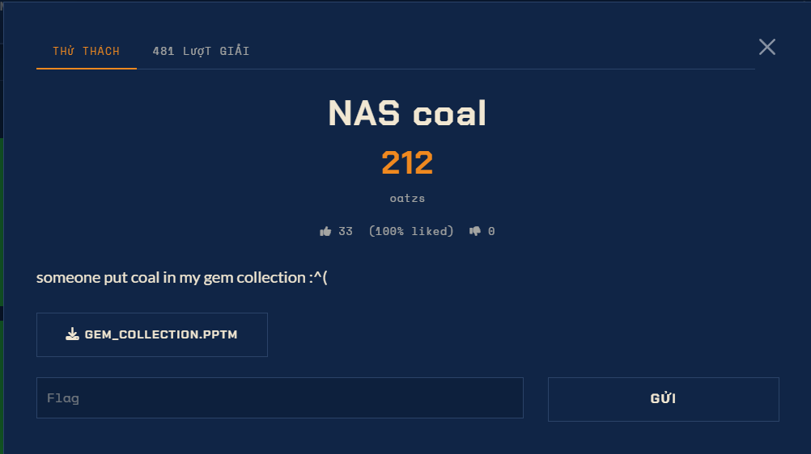

# NAS Coal — Forensics (Medium)

Ảnh đề bài gốc, chụp từ thẻ challenge:



## Challenge Text

```text
NAS coal
478 điểm · author: oatzs · 134 solves · 9 likes (100% liked)

someone put coal in my gem collection :'^(

File tải về: GEM_COLLECTION.PPTM
Flag Format: sun{...}
```

## Verified Metadata

| Field | Value |
| --- | --- |
| Artifact | `files/gem_collection.pptm` (copy từ: `../_scratch/nascoal/gem_collection.pptm`) |
| Size | 2229848 byte |
| SHA-256 | `929726804037cc9b2e8779814aabf88361a6f4035ca1d93803662bdee543e855` |
| File Type | Microsoft PowerPoint 2007+ (OOXML `.pptm`, có VBA) |
| Objective | Tìm cờ `sun{...}` giấu trong bộ sưu tập "gem" |
| Flag Format | `sun{...}` |

## Approach Summary

`.pptm` là ZIP chứa `ppt/vbaProject.bin` (OLE). Module VBA `MediaCache` có một
`-EncodedCommand` của PowerShell; base64 đó là UTF-16LE, giải mã ra đúng 4 dòng
kịch bản trong đó biến `$campaign` mang cờ. "Coal" chính là cái macro trông như
mồi nhử, còn "gem" là toàn bộ phần còn lại của file (5 slide meme, 6 ảnh, OOXML
cấu trúc) - tất cả đều sạch.

## Reproduce

```bash
python exploit.py files/gem_collection.pptm
```

Kết quả: `sun{yup_issa_gem}` (đã lưu trong `flag.txt`).
