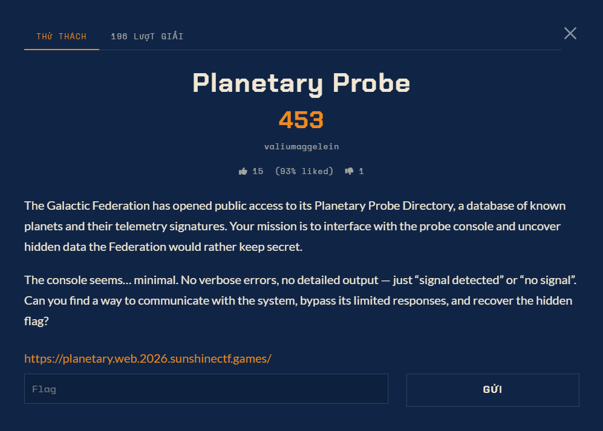

# Planetary Probe — Web (Hard)

Ảnh đề bài gốc, chụp từ thẻ challenge:




## Description

> The Galactic Federation has opened public access to its Planetary Probe Directory, a database
> of known planets and their telemetry signatures. Your mission is to interface with the probe
> console and uncover hidden data the Federation would rather keep secret.
>
> The console seems… minimal. No verbose errors, no detailed output — just "signal detected" or
> "no signal". Can you find a way to communicate with the system, bypass its limited responses,
> and recover the hidden flag?

| Field | Value |
| --- | --- |
| URL | `https://planetary.web.2026.sunshinectf.games/` |
| File kèm theo | không có |
| Điểm | 498 |

## Bề mặt tiếp cận

* `GET /` — trang console retro, một form duy nhất: `<form action="/probe" method="get">` với
  input `planet`.
* `GET /probe?planet=<x>` — chỉ trả về MỘT BIT:

  ```html
  <body class="is-carrier"> ... readout--carrier ... "Signal detected"
  <body class="is-null">    ... readout--null    ... "No signal"
  ```

  Hai kích thước trang cố định 5622 / 5604 byte. Không echo input, không error verbose,
  không log.
* `OPTIONS /probe` -> `Allow: HEAD, OPTIONS, GET`. Các route khác trả 404 thân 207 byte
  (mặc định Flask), nên không có endpoint ẩn.
* Tiêu đề trang ghi "Model IX / Interplanetary Signal Receiver"; hint trong form:
  *"The receiver reports one bit: carrier, or none. It will not say what it heard."*

## Kết luận nhanh về môi trường

* Backend là **PostgreSQL** (`-- ` là comment hợp lệ, `#` thì không), user DB tên `probe`,
  database `spacedb`, `default_transaction_read_only=true` đặt ở mức database.
* App ghép chuỗi trực tiếp:

  ```sql
  SELECT id FROM planets WHERE name = '<payload>'
  ```

* **Toàn bộ payload bị app lower-case** trước khi vào SQL (`ascii('A')=97` đúng,
  `ascii('A')=65` sai, `ascii(chr(65))=65` đúng).
* Dữ liệu trong DB: `planets(id, name, diameter_km, description)` 8 row và
  `zleak(v)` 1 row chứa đúng chuỗi `select v from zleak`.
