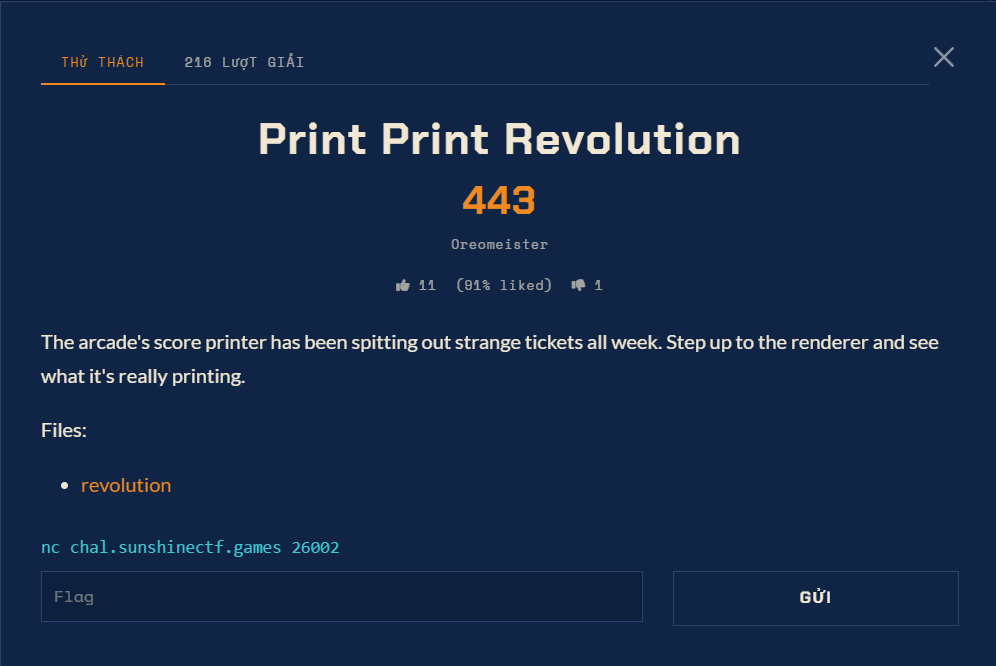

# Print Print Revolution — Pwn (Hard)

Ảnh đề bài gốc, chụp từ thẻ challenge:



## Challenge Text

```text
Print Print Revolution
498 điểm · author: Oreomeister · 1 solve · 1 like (100% liked)

The arcade's score printer has been spitting out strange tickets all week.
Step up to the renderer and see what it's really printing.

Files: revolution
nc chal.sunshinectf.games 26002
```

## Verified Metadata

| Field | Value |
| --- | --- |
| Artifact | `files/revolution` (copy từ: `C:/Users/Administrator/Downloads/revolution`) |
| Size | 14520 byte |
| SHA-256 | `918483831ef0b27d0cfb8afa9e0341f38d0a296931ccc5f73ef80f5d610f8fa5` |
| File Type | ELF 64-bit LSB executable, x86-64, SYSV, dynamic, **stripped** |
| Mitigation | no-PIE (ET_EXEC, base `0x400000`), NX bật, RELRO phủ `[0x403dc0,0x404000)` |
| Import | `write strlen strcspn read setvbuf __libc_start_main` - không có `open`/`fopen` |
| Dịch vụ | `chal.sunshinectf.games:26002`, lặp vô hạn `read` → render → `write` |
| Objective | Lấy cờ `sun{...}` từ `/ctf/flag.txt` trên container |
| Flag Format | `sun{...}` (host là sunshinectf.games, **không phải** `H7CTF{}`) |

## Approach Summary

Renderer là một `printf` tự viết, mở rộng `%` thành bộ đổi số tham số tuỳ ý, cho
ba primitive: đọc chuỗi tại địa chỉ bất kỳ, in giá trị bất kỳ, và **ghi 8 byte
tuỳ ý**. Kết hợp với việc `.got.plt` nằm ngoài vùng RELRO, ta có đủ để chiếm một
slot PLT. Không có file libc kèm theo, nên gadget `syscall` lấy bằng cách đọc
chính libc đang chạy (leak qua GOT), còn gadget xoá `rsi`/`rdx` lấy từ vDSO mà
địa chỉ nằm sẵn trong `auxv`. Số byte gửi đi trùng làm mã syscall, đóng chuỗi ROP
59 byte thành `execve("/bin/sh", NULL, NULL)`.

## Reproduce

```bash
python exploit.py
```

Kết quả: `sun{cust0m_fmtstr_n0_t00ls_4ll0wed}` (đã lưu trong `flag.txt`).
