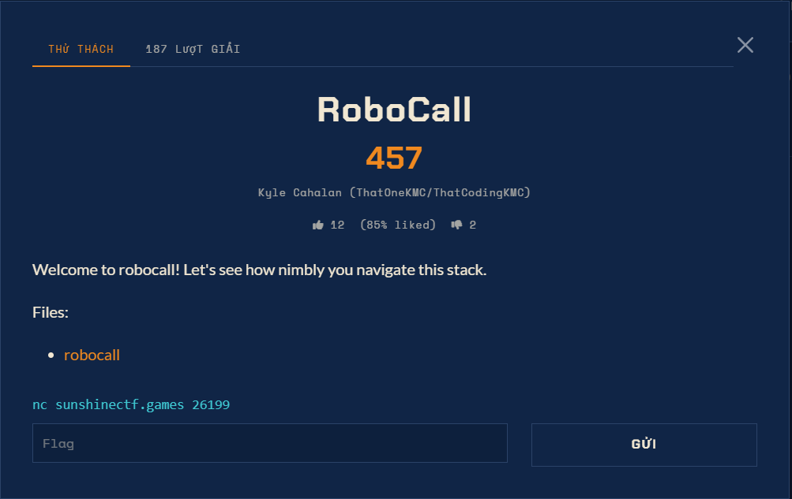

# RoboCall - Pwn (Hard)

Ảnh đề bài gốc, chụp từ thẻ challenge:



## Đề bài (nguyên văn)

> Welcome to robocall! Let's see how nimbly you navigate this stack.

Remote: `nc sunshinectf.games 26199`
Flag format: `sun{...}`
File: `robocall` (không kèm libc)

## Metadata đã kiểm chứng

| file | size | sha256 (16) | ghi chú |
|---|---|---|---|
| `files/robocall` | 30968 B | `4f27b9746e5c3e43` | ELF 64, ET_DYN (PIE), NX, Partial RELRO, động, có symbol |

Hàm trong `main.c`: `raw_print raw_eprint raw_print_int raw_readline raw_parse_int
get_random_number get_a_fun_fact place_flag main start_position initial_call start_service
report_outage billing_department technical_support upgrade_or_change other_inquiries
cancel_plan speak_with_an_operator payment_info login_roleplay initial_email scream prompt`.

Import: `open read write close nanosleep setvbuf _exit` + `__libc_start_main`.
Không có `system`/`execve`, và **quét cả file không tìm thấy một `pop reg; ret` nào**
(không có `5f c3`), nên ROP là bất khả thi.

## Cờ

`sun{you_must_be_some_sort_of_nimble_space_navigator}`

## Lệnh chạy lại

```bash
python solve.py            # lấy cả 13 chunk, tự ghép, ghi flag.txt
python solve.py --chunks 0,12
```
