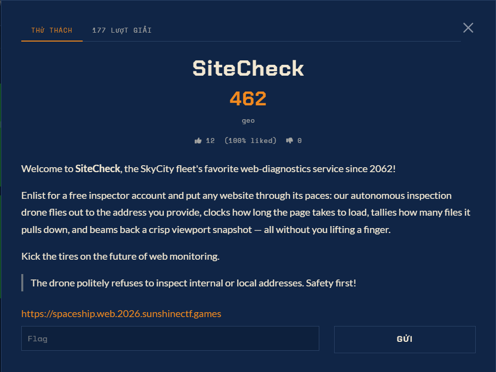

# SiteCheck — Sunshine CTF 2026 (web, 498 pts)

Ảnh đề bài gốc, chụp từ thẻ challenge:



## Đề bài (verbatim, nguyên văn từ page — phần cuối bị cắt khi paste)

```
SiteCheck
498
geo
 3 (100% liked)  0
Welcome to SiteCheck, the SkyCity fleet's favorite web-diagnostics service since

Enlist for a free inspector account and put any website through its paces: our
autonomous inspection drone flies out to the address you provide, clocks how long
the page takes to load, tallies how many files it pulls down, and beams back a
crisp viewport snapshot — all without you lifting a finger.

Kick the tires on the future of web monitoring.

The drone politely reflec   <-- CUT OFF HERE IN THE PASTE
```

## Intake

| Field | Value |
| --- | --- |
| Challenge | SiteCheck |
| CTF | Sunshine CTF 2026 (host pattern `https://<name>.web.2026.sunshinectf.games`) |
| Category | web |
| Points | 498 |
| Solves (visible) | 3, 100% liked |
| Flag format | `sun{...}` — **pinned, confirmed on the challenge page (NAS coal dùng cùng prefix)** |
| Instance URL | **CHƯA CÓ** — cần user dán |
| Source/zip | chưa có |
| Solved nghĩa là | lấy được `sun{...}` từ phía server (nội bộ) qua drone |

## Hypothesis ban đầu

Drone = server-side fetcher (headless browser hay HTTP client) tới URL do user cung cấp → **SSRF**.
"politely refuses internal or local addresses" = allow/deny list trên hostname/IP đã resolve.
Ba tính năng đề bài khoe chính là 3 oracle để đọc phản hồi:

1. **load time** → timing oracle (blind SSRF)
2. **số file tải về** → số request con / độ dài redirect chain → có thể là content oracle
3. **viewport snapshot** → screenshot, tức là có browser render → có thể đọc được nội dung qua DOM/screenshot

Hướng bypass cần test khi có target: `@` userinfo, decimal/octal/hex IP, `[::1]`/IPv6-mapped, DNS rebinding, 302 redirect từ host hợp lệ, `*.local`/`.internal` variant, port khác, `file://`/`gopher://`, và vòng lặp resolve-then-fetch (TOCTOU).

## Trạng thái

Chờ instance URL + phần đề bị cắt + file nguồn nếu có. Không tự đoán subdomain (boundary #2).
