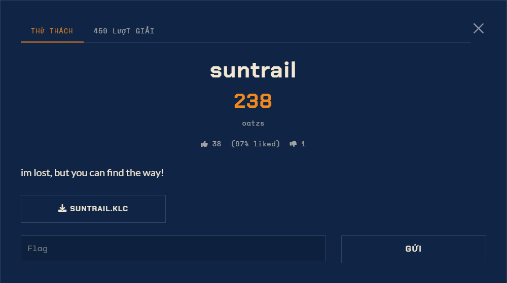

# Suntrail — Misc (Medium)

Ảnh đề bài gốc, chụp từ thẻ challenge:

- Sự kiện: H7TEX 2026
- Điểm: 482, solves: 123, likes 7/0
- Tác giả: oatzs
- Đề nguyên văn: `im lost, but you can find the way!`
- Hint: có, Cost 0 points (chưa mở, không cần vì bài đã đóng từ artifact)
- Artifact: `SUNTRAIL.KLC`
- Nộp: ô `Flag`, không có instance từ xa, bài offline thuần file

## File đã xác minh

| file | size | sha256 |
|---|---|---|
| `files/suntrail.klc` | 419 | `abe7590751412fe5607bacd7bfc4a3131e5c108bf2eedbbe78d438e96dc8c6ff` |

`file` báo ASCII text. `triage.cjs`: entropy 4.05/8, 0 hit mẫu cờ, magic plain text.
Chỉ có LF, không có byte thừa sau EOF, không có stego ở khoảng trắng cuối dòng (đã kiểm từng dòng).

## Định dạng

`.klc` là file nguồn của Microsoft Keyboard Layout Creator. Phần thân `LAYOUT` gồm các dòng
tab-separated: `<scancode> <label> <shiftstate> <unicode state 0> <unicode state 1> <-1>`.
18 phím được định nghĩa, trong đó SPACE (0x39) không mang dữ liệu.

## Ghi chú về metadata

Thẻ challenge chụp lại (`files/de.png`, lấy từ `Đề SunshineCTF 2026.docx`) ghi **238 điểm, 459 lượt giải, 38 thích (97%)**; các con số 482 điểm / 123 solves trong writeup là giá và số solve tại thời điểm làm bài. Điểm của SunshineCTF tụt dần theo số solve nên hai lần đọc khác nhau đều đúng, không có chỗ nào sai. Bài này trước đây bị để nhầm trong `H7TEX/H7CTF 2026 Quals/`; thẻ của nó nằm trong docx SunshineCTF, cờ `sun{...}`, cùng tác giả oatzs với my eyes burn / nas-coal / welcome call, nên đã chuyển sang thư mục SunshineCTF.
